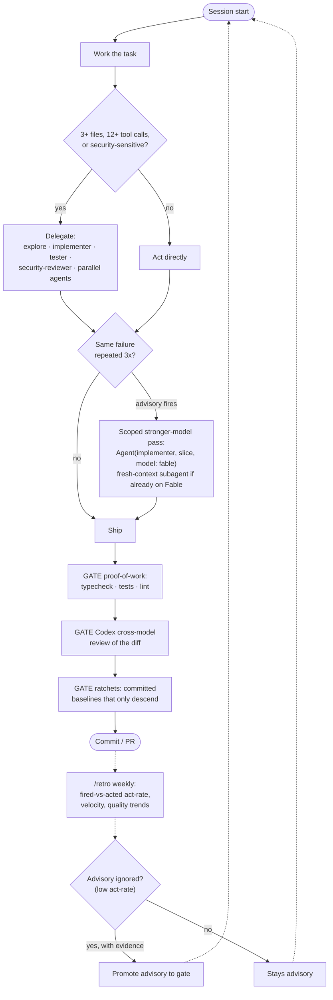

# cc-settings

Claude Code configuration for the Darkroom team — installs agents, skills, hooks, and coding standards into `~/.claude/`.

---

## Features

- **One-command install** — drops shared agents, skills, hooks, and standards into ~/.claude
- **Subagents & skills** — 10 specialized subagents and a curated, auto-invocable skill library
- **Composed settings** — settings.json assembled from modular config: permissions and hooks. The MCP fragment is installed to `~/.claude.json`, the only file Claude Code loads user-scope MCP servers from
- **Non-destructive** — existing permissions, custom hooks, and local overrides survive re-installs
- **One-command rollback** — restore the previous backup if anything looks off
- **Tamper detection** — a fingerprint plus audit guard the hooks against supply-chain attacks
- **Open standard** — AGENTS.md is read by Codex, Cursor, Copilot, and Windsurf too

---

## Install

**macOS / Linux:**

```bash
bash <(curl -fsSL https://raw.githubusercontent.com/darkroomengineering/cc-settings/main/setup.sh)
```

**Windows (PowerShell):**

```powershell
powershell -ExecutionPolicy Bypass -c "irm https://raw.githubusercontent.com/darkroomengineering/cc-settings/main/setup.ps1 | iex"
```

Both one-liners clone the repo and run the installer. To pass flags (`--light`, `--dry-run`, …), clone first and run the bootstrap from the checkout: `bash setup.sh --light` or `.\setup.ps1 --light`.

Requires [Bun](https://bun.sh) ≥ 1.2.21 and git — the bootstrap installs Bun automatically if missing. The full profile also installs `jq` if missing; no runtime hook shells out to it (all hooks are TypeScript) — it's for the `jq` one-liners used in team-knowledge remediation runbooks. Re-installs are non-destructive: existing permissions, custom hooks, and local overrides survive.

Restart Claude Code after install.

### Light profile (for newcomers)

New to Claude Code and don't want the full surface? Install the **light** profile — raw Claude Code with only two additions: the statusline and the `share-learning` skill.

```bash
bash setup.sh --light    # macOS / Linux
.\setup.ps1 --light      # Windows (PowerShell)
```

No custom CLAUDE.md, agents, rules, profiles, MCP servers, hooks (beyond the statusline), or effort overrides — just vanilla Claude Code so you're not overwhelmed. Re-run `bash setup.sh` without `--light` any time to upgrade to the full config; both tiers are permanently supported. See [MANUAL.md](MANUAL.md#light-vs-full) for the full comparison.

---

## What gets installed

```
~/.claude/
├── AGENTS.md           # Portable coding standards (read by all AI tools)
├── CLAUDE.md           # Claude-Code-specific config
├── settings.json       # Composed from config/*.json (permissions, hooks, MCP)
├── agents/             # 10 specialized subagents
├── skills/             # 39 auto-invocable skills
├── profiles/           # Stack contexts: nextjs, react-native, tauri, webgl, maestro, react-router
├── rules/              # Path-conditioned rules (load on-demand by file type)
└── src/                # Hook + script implementations (TypeScript)
```

Repo → install mapping:

| Repo dir | Installs to |
|----------|-------------|
| `agents/` | `~/.claude/agents/` |
| `skills/` | `~/.claude/skills/` |
| `rules/` | `~/.claude/rules/` |
| `profiles/` | `~/.claude/profiles/` |
| `config/*.json` | `~/.claude/settings.json` (composed) |

---

## The flow

The pieces add up to one loop: **rules start as advisories, work ships through gates, and an advisory is only promoted to a gate when telemetry proves it gets ignored.** The founding observation (from a client project where prose guardrails lost to a 10k-line agent weekend): advisory output is ignorable; a non-zero exit is not.



The three tiers, concretely:

| Tier | Can be ignored? | Examples |
|------|-----------------|----------|
| **Advisory** — injected context | Yes, by design | delegation nudge on broad prompts · quota steering · "escalate to a stronger model" after 3 identical failures |
| **Gate** — non-zero exit | No | destructive-command safety net · `tsc` before commit · proof-of-work before PR · skill-count ratchet (fails in *both* directions, so every movement of the baseline lands in git with a reviewer) |
| **Measurement** — the promotion path | n/a | every escalation advisory logs fired-vs-acted (`bun run escalate:stats`); `/retro` reports the act-rate weekly. An advisory earns gate status with evidence, never by default |

Gates live in the harness today; [sonor](https://github.com/darkroomengineering/sonor) (in progress) moves the ratchet pattern into client repos as a plain dev-dependency, so it binds agents we don't control — any harness, any model.

---

## Common commands

```bash
bash setup.sh                  # Install / update (full profile)
bash setup.sh --light          # Light profile: raw CC + statusline + share-learning only
bun src/setup.ts --rollback    # Restore the previous backup
bun src/setup.ts --dry-run     # Preview what would change
bun run compose                # Preview the composed settings.json
bun run lint:skills            # Validate skill frontmatter + count ratchet (baseline 39)
bun run escalate:stats         # Fired-vs-acted act-rate for the escalation advisory
bun run audit:hooks            # Classify hooks as trusted/unknown/suspicious
bun run typecheck              # TypeScript check
bun test                       # Run all tests
```

---

## Docs

| Doc | What's in it |
|-----|-------------|
| [MANUAL.md](./MANUAL.md) | Every skill — how to invoke it, what it does |
| [AGENTS.md](./AGENTS.md) | Coding standards and guardrails (source of truth) |
| [CLAUDE.md](./CLAUDE.md) | Claude-Code config, delegation rules, effort levels |
| [docs/profiles.md](./docs/profiles.md) | Stack-specific profiles (Next.js, RN, Tauri, WebGL, React Router) |
| [docs/skill-authoring.md](./docs/skill-authoring.md) | Writing new skills |
| [CHANGELOG.md](./CHANGELOG.md) | Release history |

---

## Why

Shared config means every engineer on the team runs the same agents, the same guardrails, and the same coding standards — no per-machine drift. `AGENTS.md` is the [open standard](https://agents.md) for AI coding instructions and is also read by Codex, Cursor, Copilot, and Windsurf, so the rules follow you across tools.

---

[darkroom.engineering](https://darkroom.engineering) · MIT
