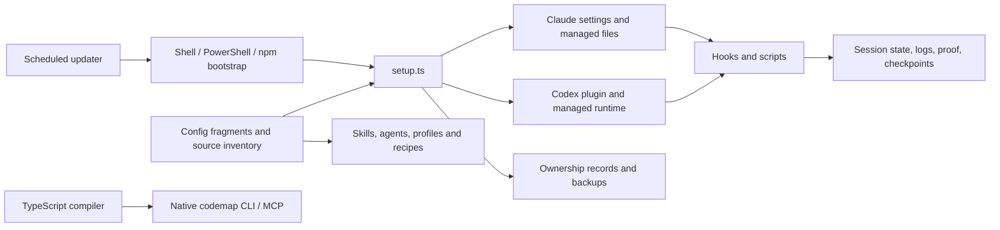

REMEDIATED — all 18 graded findings (2 High, 14 Medium, 2 Low) have been addressed. Prepared for release 15.8.1.

## Remediation results

| Findings | Resolution |
|---|---|
| H1, M2, M3 | Separate team settings provenance, refresh isolated Git indexes, serialize lock transitions and attempt every product-lock release. |
| H2, M4–M7 | Binary-complete checkpoint patches validated before reset, session-specific freezes, normalized literal paths, quoted/multiline secret redaction, exact project-file ownership stamps. |
| M8, L2 | Follow renamed imports and instantiated generic methods by symbol/declaration identity; discover config-less `.mjs` and `.cjs` files. |
| M1, L1 | Shared current source inventory, three missing audit resources, Claude manifest 7 and Codex manifest 5. Setup is 776 lines, install-cmds 626, codex-install 599; every extracted module is below 1,000 lines. |
| M9–M14 | Correct runner selection, SSR/hydration guidance, animation cleanup, build applicability, JSON-LD serialization and path containment recipes. |

Independent review approved the source extraction and corrected behavior/documentation. All 16 historical manifest lists remain unchanged; structural checks found no runtime import cycles across 60 reachable modules.

### Verification

- Full suite in an isolated checkout: **1,856 passed, 1 failed**, across 1,857 tests and 82 files. The sole failure was an existing assertion requiring the checkout path to contain `cc-settings`.
- Replaced that name-dependent assertion with the stronger exact checkout-root assertion. All **32 argument tests passed in both the original and isolated checkouts**. Every one of the 1,857 cases therefore passed across the full run and targeted rerun; the full suite was not repeated after this test-only correction.
- Typecheck, Biome, agent/skill/profile/link/shortcut checks, schema freshness and diff checks passed. No skipped tests, `.only` additions or relaxed assertions. Freeze tests intentionally replace foreign-session deletion with session isolation.
- Extracted recipe checks passed for five JSON-LD examples, ten filesystem cases, RAF/ticker cleanup/remount and six build-manifest cases.
- An initial isolated run used a symlinked dependency directory, which the installer correctly rejected. A real dependency directory corrected that verification fixture. An earlier optional full-proof run was stopped; its temporary compiler probe was removed after confirming its process had exited.
- Full-suite log: `/tmp/cc-final-tests-verified.log`; corrected argument tests: `/tmp/cc-final-original-setup-args.log`. Verification used local fixtures; no live user installation or browser was exercised. This repository has no build script.

### Remaining scope limits

Checkpoint capture excludes untracked content. A forced cross-commit restore can overwrite a currently untracked path that existed in the saved commit; the documentation now explicitly explains this limit. A stranded installation transition guard fails closed and requires manual recovery after verifying no installer is running. Advisory command checks and secret redaction retain their documented best-effort scope.

The audit below preserves the original evidence and pre-fix verdict at the audited commit. See [the remediation record](remediation-2026-09-11.md) for implementation and verification progress.

**Original verdict:** NEEDS RESTRUCTURING — ownership mistakes cause data loss, while duplicated delivery and instruction contracts create preventable drift.

# Codebase audit — 2026-09-11

Audited version **15.8.0**, commit **82d078a**. Started September 10 and completed September 11, Europe/Paris. Source remained unchanged; this report is uncommitted. **2 High, 14 Medium, 2 Low findings**, all CONFIRMED by source tracing or the reproductions described below. These IDs belong to this report, not earlier audits.

| ID | Severity | Area | Issue | Location | Status |
|---|---|---|---|---|---|
| H1 | High | Settings ownership | A second installation deletes preserved personal settings | `src/setup.ts:361` | CONFIRMED |
| H2 | High | Checkpoints | Restore loses dirty tracked binary content; safety checkpoint cannot recover it | `src/scripts/checkpoint.ts:110` | CONFIRMED |
| M1 | Medium | Distribution | Both managed installers omit required performance-audit resources | `src/lib/codex-install.ts:793` | CONFIRMED |
| M2 | Medium | Auto-update | A fresh Git index makes a clean checkout appear dirty | `src/scripts/auto-update.ts:335` | CONFIRMED |
| M3 | Medium | Installation concurrency | Two stale-lock reclaimers can both acquire the lock | `src/lib/install-lock.ts:174` | CONFIRMED |
| M4 | Medium | Session state | Another session clears an active freeze boundary | `src/lib/freeze.ts:52` | CONFIRMED |
| M5 | Medium | Advisory command guard | Raw directory prefixes accept paths escaping through `..` | `src/hooks/safety-net.ts:187` | CONFIRMED |
| M6 | Medium | Logging | Double-quoted generic secrets survive redaction | `src/lib/redact.ts:49` | CONFIRMED |
| M7 | Medium | Project initialization | A first-line product-name mention is mistaken for file ownership | `src/scripts/project-init.ts:40` | CONFIRMED |
| M8 | Medium | Code analysis | Renamed imports disappear from references and callers | `src/codemap/callgraph.ts:189` | CONFIRMED |
| M9 | Medium | Test workflow | Tester instructions invoke Bun while claiming to run Vitest | `agents/tester.md:38` | CONFIRMED |
| M10 | Medium | Hook generation | Next.js browser-API guidance ignores server prerendering | `skills/hook/SKILL.md:88` | CONFIRMED |
| M11 | Medium | Animation recipes | Cleanup leaves RAF and GSAP callbacks registered | `profiles/webgl.md:264` | CONFIRMED |
| M12 | Medium | Shipping | Mandatory build command blocks repositories without a build script | `skills/ship/SKILL.md:50` | CONFIRMED |
| M13 | Medium | SEO recipes | CMS-backed JSON-LD examples leave script delimiters unescaped | `docs/seo-reference.md:75` | CONFIRMED |
| M14 | Medium | Security recipes | The example labeled secure accepts sibling-directory traversal | `docs/security-reference.md:504` | CONFIRMED |
| L1 | Low | Structure | Three installer source files exceed 1,000 lines | `src/lib/codex-install.ts:1` | CONFIRMED |
| L2 | Low | JavaScript discovery | Config-less `.mjs`/`.cjs` projects are not discovered | `src/codemap/program.ts:41` | CONFIRMED |

## Code-Judo Opportunities

1. **Separate ownership records from restoration snapshots (H1).** A merged result describes what was written, including personal values. It cannot identify what the team owns. Record the team contribution explicitly and stop inferring ownership from equality with a merged snapshot. Preserve conservative handling of existing snapshots whose provenance is ambiguous.
2. **Use one current distribution inventory (M1, L1).** Claude and Codex repeat current resource lists while also carrying historical compatibility sets. Generate or validate the current lists from one explicit release inventory; retain historical manifests as immutable snapshots. Remove duplicate current inventories, not ownership validation.
3. **Make session identity determine storage (M4).** Store freeze state per session. This removes the destructive rule that treats a different reader as proof that the owner is stale. Inspect other globally stored session state before extending the same change.
4. **Reuse verification selection and checked implementation recipes (M9–M14).** The proof runner already examines project commands, while prose workflows select runners independently. Share that selection policy. Keep security and lifecycle examples in a form that can be checked, and link other instructions to those examples instead of copying competing implementations.

## System map and expected behavior

Installation should preserve personal content across repeated calls, serialize mutation, and distribute every required resource. Checkpoints should either preserve recoverable content or refuse before resetting it. Session guards should not alter another active session. Code analysis should report supported references faithfully. Instructions are executable product surfaces: their recommended commands and snippets must implement their stated contracts.

Expectation gaps found:

- Expected a reinstall to retain personal env/model/status-line settings; found that the persisted baseline reclassifies them as team defaults.
- Expected checkpoint undo to recover dirty tracked files; found binary notices without recoverable bytes.
- Expected an unchanged checkout to update; found `skipped-dirty` from an unrefreshed index.
- Expected an installed audit skill to include its measurement resources; found three missing files.
- Expected a foreign session to leave an existing freeze alone; found that even status inspection clears it.
- Expected symbol-aware impact to include renamed imports; found a spelling filter before symbol resolution.
- Expected secure and framework-specific recipes to be usable directly; found contradictory boundary, rendering, cleanup, and command-selection guidance.

## Findings

### Ownership, correctness and recovery

#### H1 — Repeat installation deletes personal settings

**Locations:** `src/setup.ts:361`; `src/lib/settings-merge.ts:577`; scalar/status-line baseline strategies in the same module. **Status: CONFIRMED, reproduced through actual merge and baseline APIs.**

The installer records `mergedReadBack` as the baseline. The next merge assumes an unchanged baseline value was team-owned. With team `model=opus` and a team status line, the first merge preserves personal `model=sonnet`, `USER_TOOL_CONFIG=keep-me`, and `personal.ts`. Writing and reading that exact baseline, then repeating the identical merge, produces `model=opus`, removes `USER_TOOL_CONFIG`, and selects `team.ts`.

The env pruning loop interprets a key absent from the current team config as retired, even when it was always personal. Scalar/status-line branches similarly adopt team values because personal choices equal the last merged snapshot. Handcrafted baseline tests miss this producer/consumer mismatch.

**Direction:** persist explicit team provenance separately. Treat old merged baselines conservatively instead of retroactively granting ownership. Add one write/read/reinstall regression covering personal values. Update `docs/settings-reference.md:1296` and the historical merge-design explanation with the corrected ownership contract. The historical choice to record a full snapshot explains the original format; it does not justify using it as an ownership map.

#### H2 — Binary checkpoint restore destroys the only saved dirty bytes

**Locations:** `src/scripts/checkpoint.ts:110`, reset at `:299`, apply at `:324`. **Status: CONFIRMED, reproduced in an isolated Git repository.**

A tracked binary initially contained `[0,1,2]`; the dirty working copy contained `[0,9,9]`. Save succeeded. Restore reset the file, then failed with `cannot apply binary patch ... without full index line`. The working copy became `[0,1,2]`. Both the requested checkpoint and automatic safety checkpoint contained only `Binary files ... differ`, so the advertised undo could not recover `[0,9,9]`.

**Direction:** capture binary-complete restoration material and validate it before resetting tracked files. Test save/restore of a dirty binary and failure before mutation. Existing checkpoint tests cover save/list/dispatch, not restore. Do not present a safety checkpoint as reversible unless it contains the bytes required for recovery.

#### M1 — Required audit resources are absent from both managed installations

**Locations:** `src/lib/claude-managed-file-manifests.ts:88`; `src/lib/codex-install.ts:793`; copying at `src/lib/install-fs.ts:423`; requirement at `skills/audit/SKILL.md:382`. **Status: CONFIRMED, traced through both copy paths.**

The current manifests include the audit skill but omit `skills/audit/references/performance-playbook.md`, `net-capture.mjs`, and `bundle-attribution.py`. Performance mode names the scripts as Phase 1 measurement commands. Claude copies only its selected manifest; Codex copies only its runtime manifest. No separate managed-skills copier supplies the omitted files.

**Direction:** add the resources through the supported manifest-version process, then validate that installed skills include their referenced resources. Consolidate current inventory derivation without widening ownership to arbitrary files. This finding concerns managed installer output; direct use of a complete source checkout is unaffected.

#### M2 — Auto-update skips a clean checkout

**Locations:** `src/scripts/auto-update.ts:335`, `:345`, `:359`; existing correction in `setup.sh:183`. **Status: CONFIRMED, reproduced with real Git.**

The updater uses `read-tree` to create an isolated index, then immediately calls `diff-files --quiet`. The fresh index lacks refreshed stat data. A clean fixture returned exit 0 with its normal index, exit 1 with the fresh index, and exit 0 after `update-index --refresh`. The updater maps exit 1 to `skipped-dirty` and never reaches installation.

**Direction:** apply the refresh already used by the shell bootstrap. Cover this path using a real Git fixture; success tests that shim `diff-files` to return 0 cannot catch it. Live scheduling or production updates were not exercised.

#### M3 — Stale-lock reclamation admits two installers

**Location:** `src/lib/install-lock.ts:174`. **Status: CONFIRMED with controlled timing and real filesystem operations.**

Callers A and B both observe a stale lock. A renames it and creates a fresh live lock. B resumes and renames the new lock at the same pathname, then creates its own. Both acquisition promises resolve. Atomic rename does not make the operation conditional on the identity previously inspected.

The reproduction used the actual `acquireInstallLock`, a real temporary lockfile, and a timing-only wrapper around `rename`; it reported `simultaneousHolders: 2`.

**Direction:** use an OS-backed lock or serialize stale reclamation separately and revalidate under that guard. Retain ownership-aware release. Medium reflects the uncommon stale/concurrent precondition; the consequence is concurrent destructive installation.

#### M4 — A foreign session clears an active freeze

**Location:** `src/lib/freeze.ts:52`. **Status: CONFIRMED, reproduced through the CLI.**

Session A sets a freeze. Session B runs `freeze status`. Session A then reports no freeze. The global file is cleared whenever the reader's session differs, although that does not prove the owner ended.

**Direction:** key storage by session, or ignore foreign state without deleting it. Existing tests explicitly encode the clearing behavior; remediation must identify this as an intentional contract correction, not silently relax assertions.

#### M7 — Project initialization overwrites custom instructions

**Locations:** `src/scripts/project-init.ts:40`, `:128`, `:149`. **Status: CONFIRMED, reproduced.**

An existing `AGENTS.md` beginning `# Notes for cc-settings clients` followed by personal instructions is treated as managed because the first line contains `cc-settings`. Default initialization replaces the entire file with installed defaults. Pointer files use the same ownership check.

**Direction:** recognize the exact generated ownership stamp, including explicitly supported legacy forms. A product-name mention is not authorization to overwrite content. Add a preservation regression for this concrete header.

#### M8 — Renamed imports disappear from symbol analysis

**Locations:** `src/codemap/callgraph.ts:189`, callers at `:152`. **Status: CONFIRMED, reproduced.**

Given `export function foo(){...}` and `import {foo as renamed} from './a';` followed by `renamed()`, `getImpact(project,'foo')` reports the declaration and import line but omits the call. `getContext(project,'foo')` reports an empty callers list. The text filter excludes `renamed` before the checker can resolve its alias.

**Direction:** resolve symbol identity before deciding whether a reference belongs to the target, and use that identity for caller lookup. Preserve the explicitly name-based contract of the separate `calls` tool. Do not overstate this as total change-impact failure: the reverse-import pass can still include the importing file.

### Boundary and safety contracts

#### M5 — Traversal escapes advisory allowed-directory checks

**Locations:** `src/hooks/safety-net.ts:187`, `:195`. **Status: CONFIRMED by passing command text to the hook only.**

`rm -rf /tmp/../../Users/fixture/Documents` and an absolute working-directory path followed by `/../../victim` both return exit 0. Raw prefix checks run before path normalization, so the apparent approved directory differs from the resolved target. No destructive command was executed.

**Direction:** normalize literal targets before directory-boundary checks. Keep unresolved shell syntax conservative. **Documented / By-Design calibration:** `SECURITY.md:316` defines this hook as advisory defense in depth. This is a hardening finding, not a demonstrated bypass of the host's permissions enforcement; that distinction lowered its severity.

#### M6 — Quoted generic secrets persist in logs

**Locations:** `src/lib/redact.ts:49`; persistence at `src/scripts/log-bash.ts:84`. **Status: CONFIRMED with a dummy secret.**

`DEPLOY_TOKEN="fixture-secret-value" deploy` remains unchanged through both redaction passes and is written verbatim to the daily Bash log. The assignment expressions require a non-quote character immediately after `=`.

**Direction:** cover quoted assignment values and escaping while retaining query-string boundaries. Add a focused quoted-value regression. Proven impact is extra local plaintext persistence; no exfiltration or real credential exposure was tested.

#### M13 — JSON-LD examples retain script-closing delimiters

**Locations:** `docs/seo-reference.md:75`, `:97`, `:115`, `:128`. **Status: CONFIRMED by source tracing and a serialization probe.**

Product, article, FAQ, and breadcrumb examples serialize external strings directly into `dangerouslySetInnerHTML`. `JSON.stringify({name:'</script>'})` retains the literal closing tag. A copied server-rendered recipe can therefore break out of its JSON-LD script when a content field is attacker-controlled.

**Direction:** escape `<` after JSON serialization and reuse one safe recipe. The [official Next.js JSON-LD guide](https://nextjs.org/docs/app/guides/json-ld) recommends this, and `docs/security-reference.md:246` already requires it. Medium here describes a defective shipped template, not an exposed cc-settings web endpoint. No browser exploit was run.

#### M14 — The secure traversal recipe accepts adjacent directories

**Location:** `docs/security-reference.md:504`, read at `:508`. **Status: CONFIRMED by a path-resolution probe.**

For allowed root `/tmp/uploads`, input `../uploads-private/secrets.txt` resolves to `/tmp/uploads-private/secrets.txt`. The example's `startsWith(uploadsDir)` returns true, permitting the subsequent read. The section explicitly labels this implementation secure.

**Direction:** use a separator-aware or path-relative containment check; account for symlinks when the relevant actor can create them. Validate adjacent-prefix and traversal cases in the reference recipe. Medium reflects a shipped implementation example rather than a deployed endpoint in this repository.

### Executable instructions and developer experience

#### M9 — Tester instructions select the wrong runner

**Location:** `agents/tester.md:38`. **Status: CONFIRMED instruction/API mismatch; no generated target fixture run.**

The agent targets Vitest applications but labels `bun test`, `bun test --watch`, and `bun test --coverage` as Vitest commands. In a project whose test script invokes Vitest, these invoke Bun's native runner instead and bypass Vitest configuration/setup or fail on imports.

**Direction:** inspect the project's configured script and runner, then use it consistently. Reuse the repository's existing verification-selection policy. [Bun's test documentation](https://bun.sh/docs/test) and [Vitest's invocation documentation](https://vitest.dev/guide/projects.html) distinguish these paths.

#### M10 — Next hook guidance incorrectly removes browser guards

**Location:** `skills/hook/SKILL.md:88` and its localStorage guidance. **Status: CONFIRMED against the framework contract; no generated app run.**

The stack table says Next hooks only run after hydration. A generated render-time or lazy-state initializer accessing `window`/`localStorage` can fail on prerender or direct navigation because Client Components also render on the server.

**Direction:** make initialization safe for server rendering and hydration in both stacks; defer browser-only work to the appropriate client lifecycle. [Next.js documents Client Component prerendering](https://nextjs.org/docs/app/getting-started/server-and-client-components).

#### M11 — Animation recipes retain callbacks after cleanup

**Locations:** `profiles/webgl.md:264`, `:284`. **Status: CONFIRMED by tracing callback registration and cleanup; no browser lifecycle test.**

The first example recursively schedules RAF and never cancels it. The second registers an anonymous GSAP ticker wrapper but removes `lenis.raf`, a different function. Mount/unmount/remount leaves callbacks referencing destroyed Lenis instances.

**Direction:** retain and cancel the RAF handle or use the existing Tempus cleanup convention; remove the exact ticker callback registered. Validate unmount and remount. [GSAP's ticker contract](https://gsap.com/docs/v3/GSAP/gsap.ticker/) is identity-based.

#### M12 — Shipping requires a nonexistent build command

**Location:** `skills/ship/SKILL.md:50`. **Status: CONFIRMED, command reproduced.**

The skill unconditionally runs `bun run build` and forbids proceeding on errors. This repository has no build script; the command exits 1 with `Script not found "build"`. Its own legitimate docs/config shipment cannot satisfy the procedure.

**Direction:** select applicable checks from the manifest and report an absent build as inapplicable. A configured build that fails must remain blocking. Do not add a dummy build script to disguise the workflow mismatch.

### Structure and supported surface

#### L1 — Installer modules exceed the 1,000-line threshold

**Status: CONFIRMED by line counts and source reads.**

| Source file | Lines | Coherent separation to consider |
|---|---:|---|
| `src/lib/codex-install.ts` | 3,048 | Current runtime inventory, ownership validation, backup restoration, lifecycle orchestration |
| `src/setup.ts` | 2,452 | Claude ownership/preparation and combined-target coordination |
| `src/lib/install-cmds.ts` | 1,250 | Archive validation/preparation and CLI-facing rollback execution |

The size is justified in part by real preservation and compensation requirements. This is a low-priority structural finding, not permission to remove revalidation. Correct H1–H2 and the concrete lifecycle defects before restructuring these modules.

Five test files also cross the threshold: `tests/codex-install.test.ts` (3,935), `tests/install-e2e.test.ts` (3,064), `tests/settings-merge.test.ts` (1,270), `tests/audit-hooks.test.ts` (1,150), and `tests/scripts-smoke.test.ts` (1,139). **Waived as standalone findings:** their grouped regression cases explain their size. Split by lifecycle/feature only when it improves test ownership; do not duplicate setup fixtures or remove coverage to hit a line limit.

#### L2 — Config-less JavaScript module projects are invisible

**Location:** `src/codemap/program.ts:41`; matching change-file filter in `src/codemap/change-impact.ts:13`. **Status: CONFIRMED.**

A temporary project containing only `entry.mjs` and no tsconfig returns `null` from `getTree`. The fallback extension set includes `.js/.jsx/.mts/.cts` but excludes `.mjs/.cjs`. The change-impact extension filter has the same gap.

**Direction:** include these JavaScript extensions consistently and test discovery and change filtering. Do not describe a valid JavaScript project as unavailable solely because it uses explicit ESM/CommonJS filenames.

## Dependency audit

The manifest and lockfile agree on four direct dependencies. They have distinct roles; no client bundle exists, so a client-footprint threshold is inapplicable. Context7 resolve/query calls checked the relevant APIs for all four. No dependency was changed.

| Dependency | Pinned | Currency evidence | Usage assessment |
|---|---|---|---|
| Zod | 4.4.3 | The [maintainer package source](https://github.com/colinhacks/zod/blob/main/packages/zod/package.json) and indexed package page report 4.4.3 | Native `z.toJSONSchema` and `z.looseObject` are appropriate; retain validation |
| TypeScript | 6.0.3 | [Registry latest](https://registry.npmjs.org/typescript/latest) reports 7.0.2 | One major behind; the engine uses the compiler API, so an upgrade requires explicit API migration validation, not an automatic bump |
| Biome | 2.5.4 | [Indexed package page](https://www.npmjs.com/package/%40biomejs/biome) reports 2.5.11; newer docs show another patch, so the exact latest patch is not settled here | Current VCS/include configuration is supported; no material stale-API finding |
| Bun types | 1.3.14 | Exact current package version unverified | Explicit `types: ["bun"]` and development-dependency placement match official Bun guidance |

`bun info` requests failed with DNS errors. Native browsing provided only partial registry verification; freshness is not claimed for every package. This prevents an unconditional dependency-currency pass, but does not establish a material upgrade finding. Local Bun was 1.4.1. No external CLI package was installed or upgraded.

## Design tensions

1. **Snapshot versus ownership.** Full snapshots are useful for restoration; explicit contributions are useful for reconciliation. H1 results from making one artifact serve both meanings. Weigh separate fields/artifacts with conservative migration, not increasingly elaborate equality heuristics.
2. **Current inventory versus historical proof.** Current resource lists should have one source; historical manifests must remain frozen to validate older installations. Derive the former without dynamically expanding the latter.
3. **Session state versus shared files.** A foreign reader cannot establish that an owner is dead. Prefer per-session paths over cleanup side effects on reads. Review-queue globals are a follow-up, not an additional proven defect here.
4. **Delivery-policy duplication.** Shell bootstrap, PowerShell bootstrap, and scheduled updater independently encode related source/dependency policy. M2 is a concrete divergence. Weigh shared fixtures and parity checks first; Windows still has an unfrozen install fallback that merits a separate platform review.
5. **Instructions as checked product code.** Secure recipes, lifecycle examples, and verification commands can introduce defects downstream even when this repository typechecks. Weigh a small set of checked canonical examples against maintaining many prose copies.

## Open questions

- Should codemap queries below a tsconfig root intentionally include sibling packages? A `child/` query currently returns `../a.ts` and `../b.ts` from an ancestor config. This is reproduced, but the desired scope contract is not explicit enough to grade it.
- What compatibility commitments remain for the disabled `codebase-memory` descriptor and opt-in legacy engine? Their documented status prevents treating them as accidental dead code.
- Which Linux/Windows environments are supported for optional pinned tools? The musl detector checks x86 glibc loader paths even for ARM64; native ARM64 execution was not available to establish the supported-platform impact.
- Should checkpoint recovery restore index staging separately from working-tree content? H2 requires binary safety regardless of that product decision.

These questions do not block the concrete fixes above. This audit did not open issues or apply fixes. Remediation must update the documentation describing each changed contract.

## Considered and rejected / withheld

- **Unknown user MCP fields:** current installation preserves the raw map; September 4's parser-induced loss was not re-reported.
- **Ownership tombstones and repeated rollback checks:** load-bearing preservation mechanisms, not dead-code deletions. Keep them.
- **Separate Claude/Codex adapters and proof hooks:** different host and execution boundaries justify them.
- **Safety-net as a complete enforcement boundary:** rejected after reading `SECURITY.md`; M5 remains a narrower hardening finding.
- **Pinned binary sidecar trust:** the source explicitly documents its weaker local-tampering threat model. No new exploit within the stated model was established.
- **Download provenance:** checksum verification is implemented; stronger provenance remains explicitly unimplemented. No success-only verifier was rediscovered.
- **Native codemap unsupported tools:** explicit unsupported errors are intentional. No TLDR/dead-code scanner ran, and no clean dead-code scan is claimed.
- **Atomic JSON collision, checkpoint ID/basename collisions, proof working-directory behavior:** insufficient production-path evidence to grade in this audit.
- **Additional recipe drift:** React Router return typing, resource-hint metadata, interruption-to-restore instructions, and generic hook stdout guidance warrant a focused docs follow-up; no generated application/live-host reproduction was completed for them. They are ungraded leads, not counted findings.
- **Historical merge design:** its declined full-engine proposal is historical, not an instruction to implement it. H1 challenges the current ownership assumption without reviving that proposal.

## Coverage and verification

The initial tracked inventory contained **411 files**. Readers divided installer/lifecycle source, hooks/scripts/runtime libraries, native codemap/schemas/upstream scanning, and the active instruction/configuration surface. Source reads covered those modules, including bootstrap scripts, npm entrypoint, and optional pinned-tool support. Active instruction coverage included all **38 primary skills**, **10 agents**, **6 profiles**, **12 rule files including README**, current root references, configuration, CI, host adapters, and supporting skill/hook/MCP resources. Previous September 4 findings and its rejection ledger were checked before hunting; the historical merge design was inspected for intent.

Generated schemas were checked through source schemas and freshness tests. Vendored/generated code, dependencies, historical audit archives, and historical changelog entries were excluded from a fresh full manual audit. Relevant regression tests were read fully or inspected around the affected contracts; **the entire test corpus was not manually read end to end**. The entire suite was executed. Upstream vendor claims in the large settings reference were compared with local configuration where possible, not independently reverified one by one.

Verification performed:

- `bun run typecheck`: passed.
- `bun run lint`: passed; 232 files checked, no fixes applied.
- Skill, agent, profile, shortcut, and link linters: passed. Link lint checked 950 intra-repo links. Shortcut lint reported no missing-trigger errors; no shortcut upgrade was undertaken.
- Schema freshness is covered by passing suite assertions; the schema emitter was not run because source was read-only.
- Full suite with `NO_COLOR` unset and commit signing disabled through process-local Git configuration: **1,830 pass, 2 fixture-hook failures**, 81 files, 312.46 seconds. The npm fixture's localhost server could not bind inside the sandbox, and its teardown then failed because no server existed.
- Reran `tests/npm-installer.test.ts` with local socket access: **3 pass, 0 fail**. Thus all **1,833 actual test cases** passed across the suite run and targeted rerun; this was not a single wholly green suite invocation. No tests were skipped or marked `.only`, and no assertions were changed or relaxed.
- `permissions:check` initially exited with usage because no command was supplied; a corrected `git status --json` probe returned `allow`. This is a diagnostic probe, not a live host-permission verification.
- `bun run build` was exercised for M12 and failed because no build script exists. There is no separate repository build to claim passed.

Reproduction artifacts are scratch files, not permanent tests:

| Command | Evidence |
|---|---|
| `bun /tmp/cc-audit-baseline.ts` | H1: exact first/second merge JSON |
| `bun /tmp/cc-runtime-audit.ts` | H2, M4–M7: isolated home/repo, dummy credential, hook text only |
| `bun /tmp/cc-audit-git-index.ts` | M2: normal/fresh/refreshed Git exits `0/1/0` |
| `bun /tmp/cc-audit-lock-race.ts` | M3: two simultaneous successful acquisitions |
| `bun /tmp/cc-audit-codemap.ts` | M8/L2 and ungraded scope question |

Logs: `/tmp/cc-audit-tests.log`, `/tmp/cc-audit-npm-tests.log`, `/tmp/cc-audit-runtime-repro.log`, and `/tmp/cc-audit-*.log`. Scratch paths are session-local and may later be removed; scenarios above remain the durable reproduction specification.

Independent review rechecked checkpoint loss, path-guard behavior, secret logging, project ownership, and renamed aliases. It retained the findings and narrowed security impact claims. No Claude-to-Codex bridge was used. Team-knowledge reconciliation was attempted after findings existed, but the GitHub API was unreachable; findings remain unreconciled with that external corpus. Local documented decisions were incorporated, including the advisory security boundary.

Not exercised: real user installations, production downloads/updates, launchd/systemd registration, native Windows/PowerShell or Linux ARM64 behavior, live Claude/Codex sessions, generated target applications, or browser lifecycle/exploit tests. Fixture tests and source tracing support the stated findings; they do not establish complete end-to-end correctness of those external surfaces.
