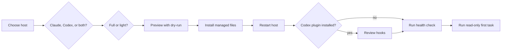
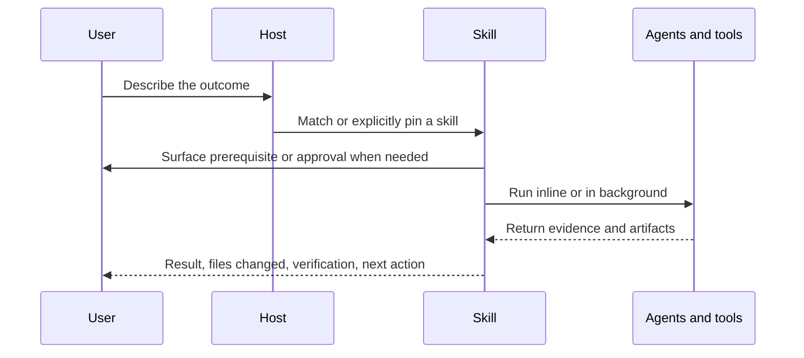
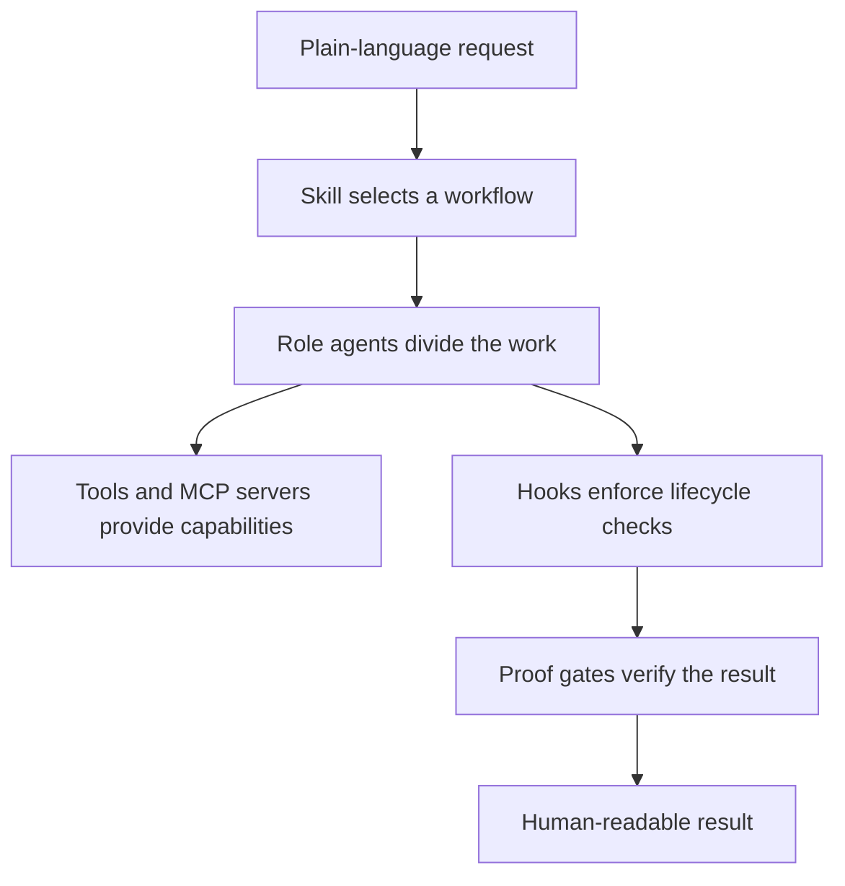

# Documentation audit, 2026-08-21

This audit reviews the current working tree as a first-time human reader, an installed user, a
returning maintainer, and an agent that treats documentation as its specification. The working tree
already contained unrelated documentation edits before this audit. This report is the only file
created by the audit.

## Summary

The documentation has a strong product idea and unusually detailed reference material. It does not
yet provide a dependable first-use path. The largest problem is not prose quality. Several docs
promise an installation or skill contract that the implementation does not honor.

| ID | Severity | Area | Issue | Evidence | Status |
|---|---|---|---|---|---|
| H1 | High | Install/runtime | The installed Claude runtime depends on the source checkout that docs imply can be discarded | `src/lib/install-fs.ts:447`, `docs/whats-on.md:7` | CONFIRMED |
| H2 | High | Security recovery | The suspicious-hook runbook uses checkout-only commands and a directory setup never creates | `SECURITY.md:189`, `SECURITY.md:211`, `src/hooks/verify-hooks.ts:54` | CONFIRMED |
| H3 | High | Claude/Codex use | Product-neutral docs teach Claude slash-command mechanics where Codex requires `$skill-name` and has narrower capabilities | `README.md:45`, `README.md:55`, `codex/AGENTS.append.md:19` | CONFIRMED |
| H4 | High | Skill contract | `triage` promises read-only external review, then changes the checkout and pulls | `skills/triage/SKILL.md:11`, `skills/triage/SKILL.md:21` | CONFIRMED |
| H5 | High | Shipping gate | `ship` says every test gate is mandatory, but `bun test || vitest run` can hide a failing configured suite | `skills/ship/SKILL.md:35`, `skills/ship/SKILL.md:69` | CONFIRMED |
| M1 | Medium | Auto-update | A remote install enrolls a temporary checkout as the update source, so cleanup breaks later updates | `setup.sh:29`, `src/setup.ts:1248`, `MANUAL.md:326` | CONFIRMED |
| M2 | Medium | Install footprint | The install reference omits the selected-product prerequisite, first-install collisions, system-package side effects, and the `~/.bun` footprint | `docs/install.md:33`, `docs/install.md:88`, `src/lib/packages.ts:114` | CONFIRMED |
| M3 | Medium | First-use diagnostics | `bun run whats-on` fails after the normal one-line install and cannot tell the user which skill fired | `README.md:55`, `MANUAL.md:73`, `docs/whats-on.md:13` | CONFIRMED |
| M4 | Medium | MCP inventory | Sanity is documented as installed, but the shipped config marks it optional | `mcp-configs/README.md:141`, `docs/settings-reference.md:1076`, `mcp-configs/recommended.json:80` | CONFIRMED |
| M5 | Medium | Skill catalog | `skills/README.md` is a stale Claude-only competing inventory that omits 16 current skills | `skills/README.md:35`, `src/lib/managed-skills.ts:31` | CONFIRMED |
| M6 | Medium | Skill ergonomics | The human manual lists triggers but not what a skill changes, asks, returns, requires, or supports per host | `MANUAL.md:597` | CONFIRMED |
| M7 | Medium | Background work | The first-use path does not explain that 23 skills run in forked background contexts and return by notification | `MANUAL.md:49`, `docs/frontmatter-reference.md:127` | CONFIRMED |
| M8 | Medium | Context lifecycle | User docs wait until 70% to warn, while active guidance says to compact at 65% | `MANUAL.md:225`, `skills/README.md:145`, `CLAUDE-FULL.md:263` | CONFIRMED |
| M9 | Medium | Skill authoring | The manual and scaffolder point to `MANAGED_SKILLS`; the canonical registry is `ACTIVE_SKILLS` | `MANUAL.md:342`, `src/scripts/new-skill.ts:66`, `docs/skill-authoring.md:101` | CONFIRMED |
| M10 | Medium | Hook reference | Reader-facing docs disagree on whether Claude Code has 29 or 30 hook events | `docs/hooks-reference.md:15`, `MANUAL.md:657`, `hooks/README.md:7` | CONFIRMED |
| M11 | Medium | Information architecture | There is no complete audience-labeled docs index; important user guides are orphaned from navigation | `README.md:124` | CONFIRMED |
| M12 | Medium | Manual structure | The 685-line manual mixes onboarding, user workflows, model policy, installation, and maintainer reference without contents navigation | `MANUAL.md:1` | CONFIRMED |
| M13 | Medium | Profiles | Profile activation is described but no supported, runnable activation recipe is given | `MANUAL.md:426`, `docs/profiles.md:1` | CONFIRMED |
| M14 | Medium | Knowledge feature | `/share-learning` omits its `gh` installation, authentication, and repository-access prerequisite | `README.md:68`, `skills/share-learning/SKILL.md:39` | CONFIRMED |
| M15 | Medium | Installer reference | Installer help shows the internal Bun command and the install guide omits three supported flags | `src/lib/install-cmds.ts:44`, `docs/install.md:1` | CONFIRMED |
| M16 | Medium | Trust and rollback | Auto-update behavior is buried, and `SECURITY.md` describes rollback as leaving launchd untouched even though rollback restores scheduler state | `MANUAL.md:326`, `SECURITY.md:177`, `src/lib/install-cmds.ts:1072` | CONFIRMED |
| L1 | Low | Register | The landing page uses TUI, MCP, lifecycle hooks, model pools, and sentinel before defining them | `README.md:3`, `README.md:77`, `docs/install.md:75` | CONFIRMED |
| L2 | Low | Historical noise | Current-contract docs contain release-history prose that belongs in `CHANGELOG.md` under the team convention | `MANUAL.md:134`, `docs/deslopper-team-mode.md:11`, `docs/settings-reference.md:58` | CONFIRMED |

Count: 5 High, 16 Medium, 2 Low. All 23 findings survived a disproof pass.

## Current documentation map

### Entry points

| Surface | Current purpose | Primary audience | Main problem |
|---|---|---|---|
| `README.md` | Public pitch, install, first prompts, feature inventory | Prospective and new users | The first success path stops before verification and host differences |
| `MANUAL.md` | Quickstart, workflows, advanced behavior, inventories | Installed users and maintainers | Several audiences and document types share one 685-line file |
| `docs/install.md` | Targets, tiers, files, lifecycle, rollback | Installers and maintainers | It calls itself a reference but omits material flags and side effects |
| `docs/codex.md` | Codex install and platform limits | Codex users | It does not teach native skill invocation or a full daily-use path |
| `SECURITY.md` | Threat model and recovery | Security-conscious users | Emergency commands do not work for the primary install path |
| `docs/whats-on.md` | Installed-state introspection | Claude users | The correct installed command is not used by the main onboarding docs |
| `docs/the-flow.md` | Product philosophy and gate model | Evaluators and maintainers | The strongest value explanation is buried |

### Capability surfaces

- `skills/README.md` is a human explainer and partial inventory.
- `MANUAL.md` is the main human skill chooser.
- The 38 `skills/*/SKILL.md` files are executable specifications for the model, totaling 7,687
  lines. They contain the deepest contracts, but they are not a workable human manual.
- `docs/frontmatter-reference.md` and `docs/skill-authoring.md` are maintainer references.
- `agents/*.md`, `rules/*.md`, `profiles/*.md`, and `hooks/*.md` are runtime instructions with a
  secondary maintainer audience.

### Reference and history surfaces

- `docs/` contains 26 top-level guides plus five historical audit records.
- The largest references are `docs/settings-reference.md` at 1,243 lines,
  `docs/hooks-reference.md` at 628 lines, and `docs/security-reference.md` at 592 lines.
- `CHANGELOG.md` is the 4,048-line release record.
- No `docs/README.md` routes readers by task or audience.
- The existing link linter validates links that exist. It does not detect orphaned documents.

## Findings

### H1. Installed Claude scripts are not independent of the checkout

**Location:** `src/lib/install-fs.ts:447-467`, `setup.sh:29-43`, `docs/install.md:92-105`,
`docs/whats-on.md:7-11`

**Issue:** The installer copies TypeScript into `~/.claude/src`, then symlinks
`~/.claude/src/node_modules` to `<source>/node_modules`. Installed scripts import packages such as
Zod through that link. The docs say the installed `whats-on` script works whether or not the
checkout was kept, and the installed-file tree does not disclose the dependency.

**Scenario:** A newcomer clones the repository, installs, and later deletes the clone. The statusline,
hooks, and installed scripts now resolve through a dangling dependency link. The remote one-liner
clones to `mktemp`; that temporary path becomes the undocumented runtime source and can disappear
after cleanup.

**Recommended direction:** Package runtime dependencies inside managed state. If that cannot land
immediately, make a persistent source checkout an explicit prerequisite and show its required path.

### H2. The security recovery path fails when it is needed most

**Location:** `SECURITY.md:189-232`, `README.md:101-103`, `src/hooks/verify-hooks.ts:54-91`

**Issue:** The runbook says `bun run audit:hooks` works from anywhere and tells users to run setup
from `~/.claude/cc-settings`. The package script requires a checkout, and the installer never creates
that directory. The installed scanner is `bun ~/.claude/src/scripts/audit-hooks.ts`.

**Scenario:** A remote-install user receives `SUSPICIOUS HOOKS DETECTED`. Every documented first
response fails before the user can distinguish a false positive from compromise.

**Recommended direction:** Use the installed absolute command in the hook warning, README, and
runbook. Give one canonical clone command for reinstall/fingerprint refresh and never assume a
checkout path.

### H3. The shared skill story hides host-specific interaction

**Location:** `README.md:43-55`, `MANUAL.md:47-68`, `docs/codex.md:123-138`,
`codex/AGENTS.append.md:19`

**Issue:** The landing page and manual address Claude Code and Codex together, then say slash names
such as `/fix` pin a workflow. The standalone Codex adapter says to invoke shared skills as
`$skill-name`. The same quickstart also promises Context7, Chrome-backed QA, and Lighthouse behavior
that a full Codex install does not include.

**Scenario:** A fresh Codex user tries `/fix` from the shared manual and hits an invocation-form
mismatch. The same user tries `/qa` or `/lighthouse` and hits a capability or prerequisite mismatch.
In both cases, the docs make a host boundary look like a failed install.

Claude has a related unresolved collision. The README says slash names pin a workflow, while the
manual says native `/review` aliases `/code-review` and cc-settings also owns `/review`
(`MANUAL.md:75`, `MANUAL.md:134`). No page gives precedence or a qualified picker name. The runtime
winner is PLAUSIBLE until exercised in the TUI; the documentation gap is CONFIRMED.

**Recommended direction:** Put a Claude/Codex column in the first-use table. Document `$skill-name`
for Codex, `/skill-name` for Claude, and the exact optional dependencies per workflow.

### H4. `triage` violates its own read-only guarantee

**Location:** `skills/triage/SKILL.md:11-21`

**Issue:** The skill says external repositories are read-only and forbids commits, pushes, or PRs.
Its first workflow step runs `git checkout main` and `git pull`, which changes the user's branch and
working tree.

**Scenario:** A user asks for a report-only client-repository review while on a local branch. The
skill changes repository state before producing findings.

**Recommended direction:** Use `git fetch` and inspect a remote ref, or require explicit approval
before changing the checkout. Keep the read-only promise literal.

### H5. `ship` can accept a failing configured test suite

**Location:** `skills/ship/SKILL.md:35-75`

**Issue:** The skill calls every gate mandatory and says not to proceed until green. Its fallback
command is `bun test || vitest run`. A real failure from the configured Bun suite can fall through to
a narrower passing Vitest run.

**Scenario:** `bun test` runs integration tests and fails. `vitest run` covers only unit tests and
passes. The workflow continues despite the documented gate.

**Recommended direction:** Detect the configured runner before execution, run exactly one intended
suite, and preserve its non-zero result.

### M1. Remote auto-update points at temporary state

**Location:** `setup.sh:29-43`, `src/setup.ts:471-483`, `src/setup.ts:1248-1254`,
`MANUAL.md:326-340`

**Issue:** The remote bootstrap uses a temporary clone. Auto-update stores that source path as
`repo_path` and later tries to pull it. The manual promises a daily update of “the cc-settings repo”
without disclosing that the remote path is temporary.

**Scenario:** A user accepts auto-update during the one-line install. A later OS temp cleanup or
reboot can remove the recorded repository path; subsequent updates then skip with “repo not found.”

**Recommended direction:** Enroll auto-update only from a persistent checkout, or install a managed
persistent clone and disclose it in the footprint.

### M2. The install footprint is incomplete

**Location:** `docs/install.md:33-45`, `docs/install.md:88-127`, `src/lib/packages.ts:114-148`,
`src/setup.ts:1060-1080`

**Issue:** The requirements omit the selected TUI itself. The footprint lists product homes but not
possible Bun installation under `~/.bun`, system package-manager use for `jq`, or Claude
first-install collision rules.

**Scenario:** A new laptop with neither Claude Code nor Codex reports a successful config install but
has no TUI to open. An existing Claude user can instead hit an undocumented ownership collision on
their personal `CLAUDE.md`.

**Recommended direction:** Add a side-effects table with path, action, prompt, ownership, rollback,
and uninstall behavior. Link product installation and document the collision migration path.

### M3. `whats-on` is both invoked and described incorrectly

**Location:** `README.md:55`, `MANUAL.md:73`, `MANUAL.md:508`, `docs/whats-on.md:3-31`

**Issue:** `bun run whats-on` needs a repository checkout. The main install path leaves users outside
one. The README also says the command explains “what fired and why,” but the tool reports user-scope
installed state and explicitly does not resolve all project overrides or invocation history.

**Scenario:** A user installs by one-liner, asks which skill handled a prompt, and gets a package
script error. The corrected installed command still answers a different question.

**Recommended direction:** Use `bun ~/.claude/src/scripts/whats-on.ts` in Claude user docs and scope
the tool explicitly to Claude. Document a Codex-native inspection path, or state that no equivalent
exists. Rename the promise to “what is installed and shaping this user scope.” Document a separate
invocation-debug path if one exists.

### M4. MCP inventory has two conflicting sources of truth

**Location:** `config/20-mcp.json:2-32`, `mcp-configs/README.md:141-149`,
`docs/settings-reference.md:1055-1090`, `mcp-configs/recommended.json:80-87`

**Issue:** The shipped Claude config contains Context7, TLDR, Figma, and Chrome DevTools. Sanity is
optional. Two reference docs list Sanity as configured or installed by default.

**Scenario:** A new Sanity project expects authenticated CMS tools after setup and finds no Sanity
server.

**Recommended direction:** Generate the configured-server table from `config/20-mcp.json` and the
optional table from `mcp-configs/recommended.json`.

### M5. `skills/README.md` is a stale competing catalog

**Location:** `skills/README.md:5-93`, `src/lib/managed-skills.ts:31-69`

**Issue:** The categories omit 16 of 38 current skills. The guide is Claude-only, claims creation
skills run directly in main even though `design-tokens` forks, and assigns `audit` as a `verify`
trigger that the real selector does not carry.

**Scenario:** A reader enters `skills/` for the detailed capability list and learns an older product
shape than the one installed.

**Recommended direction:** Replace this file with a short platform-neutral model and link to one
generated skill inventory. Do not maintain a second hand-written catalog.

### M6. The manual documents triggers better than skill ergonomics

**Location:** `README.md:131`, `MANUAL.md:597-639`

**Issue:** The README calls the manual “Every skill, how to invoke it, what it does.” The All Skills
table contains only the skill name and trigger phrases. Several skills appear nowhere else in the
manual with a human interaction contract.

**Scenario:** A user can discover `freeze`, `review-batch`, `retro`, `strategist`, or `codex`, but
cannot learn whether it is read-only, what it writes, when it asks, what it returns, or whether it
works in their host without reading the executable prompt.

**Recommended direction:** Generate compact skill cards with: say this; value; reads/writes;
approval points; output; background/foreground; prerequisites; Claude behavior; Codex behavior;
nearby alternatives.

### M7. Background skill behavior is invisible in onboarding

**Location:** `MANUAL.md:49-71`, `docs/frontmatter-reference.md:127-140`

**Issue:** Twenty-three skills use forked background contexts and return by task notification. That
behavior is documented only in maintainer frontmatter reference.

**Scenario:** A first-time `/build` or `/fix` user sees the work leave the conversation and does not
know they may continue chatting, how completion appears, or how to follow up.

**Recommended direction:** Add one “what you will see” timeline immediately after the first prompt
examples.

### M8. Context lifecycle guidance conflicts

**Location:** `MANUAL.md:225-239`, `skills/README.md:145-153`,
`skills/handoff/SKILL.md:136-172`, `CLAUDE-FULL.md:261-265`

**Issue:** User docs begin warning at 70% while active behavior says to compact manually at 65%.
Samples also still show Opus 4.8 while the configured default is Opus 5.

**Scenario:** A user follows the manual and crosses the active compaction point before the first
documented warning.

**Recommended direction:** Keep one canonical lifecycle table and link to it from the skill and
manual.

### M9. Skill authoring sends contributors to the wrong registry

**Location:** `MANUAL.md:342-348`, `src/scripts/new-skill.ts:66-73`,
`docs/skill-authoring.md:101-104`, `src/lib/managed-skills.ts:15-31`

**Issue:** The canonical list is `ACTIVE_SKILLS`. The manual and generated next steps tell authors to
edit `MANAGED_SKILLS` in `src/setup.ts`.

**Scenario:** A contributor follows both the quick manual and scaffold output and edits a derived or
non-canonical symbol.

**Recommended direction:** Fix the two instructions and generate the inventory from
`ACTIVE_SKILLS`.

### M10. Hook counts drift across human-facing docs

**Location:** `docs/hooks-reference.md:15`, `src/schemas/hooks.ts:7-44`, `MANUAL.md:657`,
`hooks/README.md:7-8`, `CLAUDE-FULL.md:292`

**Issue:** The schema and hook reference contain 30 events. Three other surfaces say 29.

**Scenario:** A maintainer audits event coverage using the manual and cannot tell which event is
missing.

**Recommended direction:** Generate the event count from the schema or remove the count outside the
canonical hook reference.

### M11. Human navigation covers a mixed minority of the docs

**Location:** `README.md:124-136`

**Issue:** The README links nine documents. The repository has 26 top-level guides under `docs/`,
plus user-facing READMEs and runtime references. There is no `docs/README.md`. `docs/whats-on.md`,
`docs/github-workflow.md`, and `docs/cache-strategy.md` have no inbound Markdown links.

**Scenario:** A returning user knows the repository documents a behavior but must know its filename
or search the tree. An agent path reference may keep the file alive without making it human-findable.

**Recommended direction:** Add one complete docs index grouped by Use, Understand, Maintain, and
History. Mark every document's audience and status.

### M12. The manual combines incompatible document jobs

**Location:** `MANUAL.md:1-685`

**Issue:** The manual combines a tutorial, task guide, conceptual model, model-price commentary,
install reference, maintainer commands, and raw inventories without a contents section.

**Scenario:** A new user scanning for “what will `/build` do?” encounters installation and model
policy; a maintainer hunting the skill registry scans the same file from the other direction.

**Recommended direction:** Keep the manual as a task-oriented skill chooser. Move installation,
models/context, and maintainer authoring to dedicated canonical references. Add audience shortcuts.

### M13. Profile activation is not executable from the docs

**Location:** `MANUAL.md:426-441`, `docs/profiles.md:1-43`

**Issue:** The manual says to activate profiles in `settings.json` but gives no key or value. The
profile guide says `@profile-name` references or per-project setup apply them without showing either
workflow, then explains that frontmatter is advisory.

**Scenario:** A newcomer copies profile frontmatter into settings and nothing changes.

**Recommended direction:** Show one supported activation recipe with scope and lifetime, or remove
the activation promise if package detection already covers the intended use.

### M14. `/share-learning` hides its external prerequisite

**Location:** `README.md:68`, `docs/knowledge-system.md:22-39`,
`skills/share-learning/SKILL.md:39-85`

**Issue:** The skill writes through `gh api`, but its frontmatter has no `requires: command: gh` and
the user guide does not say the CLI must be installed, authenticated, and authorized for the team
repository.

**Scenario:** A new teammate's first shared learning fails only after the workflow begins.

**Recommended direction:** Add the requirement to skill metadata and the install/knowledge guide,
including `gh auth status` and a repository-read check.

### M15. The installer reference and help surface are incomplete

**Location:** `docs/install.md:1-4`, `docs/install.md:139-167`,
`src/lib/install-cmds.ts:44-77`

**Issue:** `bash setup.sh --help` prints `Usage: bun src/setup.ts [flags]`. The page that claims to
cover flags omits `--auto-update`, `--interactive`, and `--source`.

**Scenario:** A Windows or shell-wrapper user asks for help and gets an implementation command that
does not match the entry point they ran. A user cannot discover conflict prompts from the canonical
install page.

**Recommended direction:** Parameterize help by wrapper, or document the public shell and
PowerShell forms first. Make the install page's flag table complete.

### M16. Auto-update trust and rollback semantics are buried or wrong

**Location:** `MANUAL.md:326-340`, `SECURITY.md:107-181`,
`src/lib/install-cmds.ts:1072-1089`, `src/lib/install-cmds.ts:1137-1143`

**Issue:** The install reference does not disclose the daily launchd prompt. The security guide says
rollback never touches LaunchAgents, but rollback restores scheduler state captured in the backup.

**Scenario:** A user disables auto-update, rolls back under the documented assumption that scheduler
state is untouched, and an older enrolled state returns.

**Recommended direction:** Put auto-update in the install side-effects table. State that rollback
restores captured scheduler state and tell users to check or override enrollment afterward.

### L1. The landing page assumes vocabulary the reader has not learned

**Location:** `README.md:3-6`, `README.md:77-97`, `docs/install.md:75`

**Issue:** TUI, lifecycle hook, model pool, MCP, and sentinel appear before definition.

**Scenario:** A reader can repeat the component list without understanding what changes in daily
work.

**Recommended direction:** Use product nouns first, then define necessary terms inline once.

### L2. Current reference docs carry release-history prose

**Location:** `MANUAL.md:134`, `docs/deslopper-team-mode.md:11`,
`docs/settings-reference.md:58-69`

**Issue:** Current contracts contain “removed,” “previously,” version transitions, and release
chronology. The team convention `history-belongs-in-git-not-code` says current docs should describe
the present state; history belongs in `CHANGELOG.md`.

**Scenario:** A first-time reader has to separate compatibility requirements from a running release
journal before finding the current behavior.

**Recommended direction:** Keep minimum supported versions and current caveats. Move change history
to `CHANGELOG.md` and link it only where migration context is required.

## Proposed documentation map

```text
README.md
|-- problem and value
|-- five-minute first success
|-- Claude / Codex / both chooser
`-- audience routes
    |-- Use cc-settings
    |-- Understand cc-settings
    `-- Maintain cc-settings

docs/
|-- README.md
|-- getting-started/
|   |-- install.md
|   |-- first-session.md
|   |-- claude-vs-codex.md
|   `-- troubleshooting.md
|-- user-guide/
|   |-- skills.md
|   |-- workflow-boundaries.md
|   |-- inspect-your-setup.md
|   |-- session-management.md
|   |-- profiles.md
|   |-- knowledge.md
|   `-- github-workflow.md
|-- concepts/
|   |-- system-overview.md
|   |-- the-flow.md
|   |-- safety-and-trust.md
|   `-- models-context-and-cost.md
|-- reference/
|   |-- installer-cli.md
|   |-- settings.md
|   |-- hooks.md
|   |-- mcp.md
|   |-- skill-frontmatter.md
|   `-- agent-frontmatter.md
|-- maintainers/
|   |-- contributing.md
|   |-- skill-authoring.md
|   |-- agent-authoring.md
|   |-- release-and-upstream-sync.md
|   `-- internal/
`-- history/
    |-- decisions/
    |-- audits/
    `-- upstream-bugs/
```

Every file should start with audience, purpose, and status. The human skill guide should be
generated from one structured inventory rather than copied across `MANUAL.md`, `skills/README.md`,
and `docs/frontmatter-reference.md`.

## First-use journey that the docs should support

```text
install selected TUI
        |
clone for preview or run one-liner
        |
review full/light and side effects
        |
dry-run, then install
        |
restart selected TUI
        |
Codex: review /hooks
        |
run product-specific install health
        |
inspect active configuration
        |
ask a harmless read-only /explore question
        |
see which workflow ran and what it returned
        |
know how to disable, rollback, or uninstall
```

The first success should be read-only. Do not make “ship it” the only concrete proof that the setup
works.

## Diagram backlog

### 1. Installer choice and side effects

Target: `docs/getting-started/install.md`, immediately after the opening summary.



### 2. Natural-language skill lifecycle

Target: `docs/user-guide/skills.md`, after “How selection works.”



### 3. Runtime relationship

Target: `docs/concepts/system-overview.md`, after the value statement.



## Missing-docs backlog

1. **First session:** one harmless task, expected output, background behavior, and recovery.
2. **Claude versus Codex:** invocation syntax, plugin availability, MCP differences, background
   behavior, and unsupported/narrower skills.
3. **Canonical skill chooser:** generated cards with value and interaction contract.
4. **Troubleshooting:** install health, installed-state inspection, which skill ran, hook trust,
   missing prerequisites, rollback, and uninstall.
5. **Complete docs index:** audience, purpose, status, and canonical source for every guide.
6. **Installer side-effects reference:** all paths and system changes, ownership, prompts, and undo.

## Design tensions

### 1. “No commands to learn” versus observable control

Natural-language routing is the right default. Users still need to know what was selected, whether
it runs in the background, what it can change, and how to override it. The docs currently treat
those controls as maintainer detail.

**Alternative to weigh:** Keep ordinary language as the interface, but expose a small inspection
contract after every workflow: selected skill, host branch, background status, mutations, and
verification.

### 2. Shared source versus shared behavior

Claude and Codex receive the same 38 skill sources, but they do not offer the same invocation syntax,
MCP set, hooks, orchestration, or enforcement. “Shared skills” currently reads as behavior parity.

**Alternative to weigh:** Define a shared outcome contract, then document host-specific execution in
one parity matrix. Shared should mean the outcome and safety boundary, not identical mechanics.

### 3. Executable prompts versus human product documentation

The skill files are detailed because the model needs procedural precision. Humans need value,
effects, boundaries, and examples. One artifact cannot serve both audiences cleanly.

**Alternative to weigh:** Add structured user-facing metadata beside frontmatter and generate human
skill cards. Keep procedural bodies agent-facing.

### 4. Rich references versus current truth

The repository has unusually deep reference material, but several inventories are copied by hand.
The clean link and skill linters cannot detect semantic drift between those copies.

**Alternative to weigh:** Generate counts and inventories from schemas/config. Keep prose for intent,
examples, and decisions only.

### 5. Fast remote install versus durable ownership

The one-liner optimizes first contact. Runtime dependencies, auto-update, security recovery, and
maintenance all assume durable source state.

**Alternative to weigh:** Make the one-liner install a self-contained managed runtime, or make a
persistent clone the honest default. The current hybrid has the ergonomics of neither.

## Open questions

1. Is cc-settings intended only for Darkroom employees with pre-provisioned Claude/Codex, `gh`
   access, and repository access, or should the public README support an external user?
2. Should a remote one-line install create and own a persistent checkout, or should all installed
   runtime dependencies be copied into product-managed directories?
3. Does the Codex plugin UI expose a stable visible name for every `$skill-name`, and is there an
   invocation-history surface the docs can point to?
4. Should profiles remain user-activated artifacts, or should package detection make them internal
   implementation references?
5. Is auto-update meant to be an onboarding default, an opt-in advanced feature, or a maintainer-only
   convenience?

## Drift verification

| Check | Result |
|---|---|
| `bun run lint:links` | PASS: 132 Markdown files, 46 intra-repo links, 0 errors, 0 warnings |
| `bun run lint:skills` | PASS: 38 skills, 0 errors, 0 warnings |
| Documentation-focused tests | PASS: 53 tests across six files |
| `bun src/setup.ts --help` | PASS as executable help; exposed usage is the internal Bun entry point |
| `bash setup.sh --target=claude --dry-run` | PASS; confirms managed file inventory but does not expose the runtime dependency link |
| Skill directory count | 38, matching the main README and manual |
| Claude MCP config | Four configured servers; Sanity absent and optional elsewhere |
| Hook event schema | 30 events; three reader-facing surfaces say 29 |
| Team-knowledge reconciliation | `history-belongs-in-git-not-code` confirms L2; no note suppresses another finding |

## Considered and rejected

- **Broken Markdown links:** rejected. The link linter passed all 46 existing intra-repo links.
- **Primary skill count drift:** rejected. README, manual, install docs, Codex docs, registry, and
  linter agree on 38.
- **Audit mode drift:** rejected on the current working tree. The source skill and manual both
  describe eight modes.
- **Full/light tier drift:** rejected. The main install and Codex references agree on tier contents.
- **Codex ownership preservation drift:** rejected. The docs match the marked-block and sentinel
  implementation.
- **Uninstall backup behavior drift:** rejected. Docs and implementation agree that backups remain.
- **Bun minimum drift:** rejected. Docs and `package.json` agree on Bun 1.2.21 or newer.
- **Every skill file is unsuitable for humans:** rejected as too broad. Many executable prompts have
  strong output and boundary sections. The problem is that the human manual does not surface those
  contracts consistently.
- **Every unlinked document is dead:** rejected. Several are loaded by agents through bare paths.
  The surviving finding is human findability, not runtime reachability.

## Strengths worth preserving

- The README correctly makes ordinary language the default interface.
- The manual's distinction among review, proof, verify, QA, triage, and audit is excellent.
- The install target/tier matrices and ownership-aware rollback explanation are unusually candid.
- Complex skills increasingly carry explicit standalone-Codex branches and fail-loud fallbacks.
- `docs/the-flow.md` explains the real value of gates with a concrete failure that motivated them.
- The link, schema, and skill-count checks provide a strong base for generated documentation.
