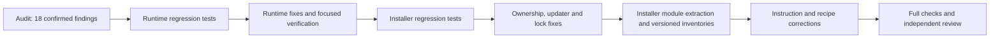

## Functional DAG

## Scope and progress

User authorized all high, medium and low findings in `codebase-audit-2026-09-11.md`.
Writers run sequentially. Each behavior fix receives focused tests and typechecking before the next fix. This repository has no build script.

- [x] H2, M4–M8, L2: checkpoint recovery, session freeze, path guards, redaction, project ownership, symbol aliases and JavaScript discovery. Focused runtime suite: 170 passed, zero failed/skipped; typecheck and Biome passed. Independent review corrections verified and approved.
- [x] H1, M2, M3: settings provenance, fresh Git index refresh and serialized lock reclamation. Independent focused checks: 140 passed, typecheck passed. Full installer E2E: 86 passed. Review follow-up ensures all product locks are released despite one cleanup failure; its regression and three lock tests passed.
- [x] M1, L1: Claude manifest 7 and Codex manifest 5 include missing performance resources and twelve extracted installer modules. Setup 776 lines, install-cmds 626, codex-install 599; largest new module 833. Sixteen historical lists unchanged; no runtime cycles across 60 modules. Setup/settings 126, backup 21, Codex 178 tests passed. Claude E2E 85 passed initially; corrected expected inventory and isolated-index tracking checks both subsequently passed. Final verification is recorded below.
- [x] M9–M14: runner selection, SSR, animation cleanup, optional build selection, JSON-LD and traversal recipes. Extracted recipe checks and documentation lints passed; independent review approved.
- [x] Documentation/changelog, complete verification and independent review. Full suite 1,856 passed with one checkout-name assertion failure; strengthened that assertion to exact checkout root, then all 32 argument tests passed in both checkouts. All 1,857 distinct cases verified across runs, no skips. Typecheck, lint, documentation checks, schema freshness and diff checks passed. No commits or original-index changes.

## Contracts

- Keep merged settings snapshots separate from explicit team provenance. Legacy snapshots do not establish ownership.
- Validate complete checkpoint restoration material before modifying tracked files.
- Freeze scopes belong to sessions; foreign readers cannot clear them. Tests asserting foreign-session deletion intentionally change to the corrected contract.
- Preserve historical installation manifests and all ownership/rollback checks during extraction.
- Run configured verification commands; report absent commands as inapplicable and failures as failures.
- No commits, publishing or live user installation changes are included.

## Release preparation

The user subsequently authorized publishing these fixes. Release 15.8.1 updates the installer,
package and both plugin versions together; the audit notes above retain their original verification scope.

## Installer extraction handoff

Runtime review corrections also complete: quoted/bare shell continuations redact correctly, and instantiated generic methods match their original declarations. Focused checks passed. No skipped assertions or test weakening; freeze's old foreign-session deletion contract was deliberately corrected.

After H1, extract settings, ownership and lifecycle from setup; extract rollback validation from install-cmds. Extract Codex shared state, manifests, native agents, runtime, plugin operations and backup restoration from codex-install. Keep public entrypoints and exact compensation/ownership checks. Lower-level modules never import orchestration. Backup owns restorePluginStateAndConfig and removeCurrentManagedCodexState to avoid cycles; runtime owns ensureRuntimeDependencies.

Create an explicit shared current source inventory. Freeze Claude versions 1–6 and Codex versions 1–4, then introduce Claude 7 and Codex 5 with all new runtime modules and the three missing audit performance assets. All TypeScript modules ship in both Claude profiles; preserve light profile skill scope. Replace the Codex test's inline-list regex with the exported inventory while retaining import-closure assertions. Check historical sets are unchanged and affected source modules remain below 1,000 lines.
