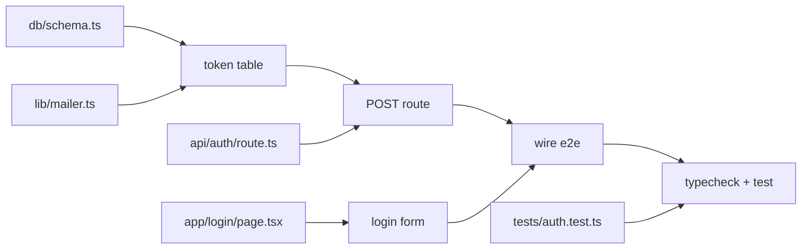

# Functional DAG

Every plan opens with one. It is the recipe-table form popularized by *Cooking for
Engineers*: inputs down the left, operations merging rightward, exactly one dish at the
end.

A bullet list hides the two things a plan exists to answer — **what must be finished
before this step can start**, and **what can run at the same time**. A DAG shows both in
the shape itself: each join names its inputs, and each column is a topological level, so
anything sharing a column with disjoint inputs is a parallel batch.

---

## Required form

A fenced code block, brace style, in a section titled `## Functional DAG`.

```
prereq ── git checkout -b feat/magic-link
prereq ── bun install

db/schema.ts ─────────┐
                      ├── token table ──┐
lib/mailer.ts ────────┘                 │
                                        ├── POST route ──┐
api/auth/route.ts ──────────────────────┘                │
                                                         ├── wire e2e ──┐
app/login/page.tsx ────── login form ────────────────────┘              │
                                                                        ├── typecheck + test
tests/auth.test.ts ─────────────────────────────────────────────────────┘
```

Read it as: `token table` cannot start until both `db/schema.ts` and `lib/mailer.ts` are
done; `login form` shares column 1 with `token table` and touches none of the same
inputs, so those two are the parallel batch; nothing is shippable until the single
terminal node passes.

**Authoring rules**

1. `prereq ──` rows go at the top and are a **sequential pre-phase, not DAG nodes** —
   branch, install, migration, env var. They gate every column and are excluded from
   batch detection, so don't draw edges from them: they all complete before column 1
   starts. Treating them as ordinary roots would let batch detection schedule
   `bun install` alongside the work that needs it. No prereqs is a valid answer; drop
   the rows.
2. One input per line on the left: a file path, an artifact, an external dependency, or
   an upstream task ID. Real paths, not categories.
3. Every join is labeled with the **operation**, in the imperative and small enough to
   verify (`widen Settings type`, not `refactor config`).
   An operation's **level is the column its label sits in** — align labels at the same
   level so the batches are readable. A line passing through a column without a bracket
   is routing, not participation (`login form` below crosses column 2 untouched).
4. Order rows so each operation's inputs are vertically adjacent — the bracket has to
   span a contiguous block. Reordering rows to make a span contiguous is free; changing
   what an operation consumes is not.
5. Exactly one terminal node, and it is the verification gate (`typecheck + test`,
   `bun test` → exit 0, screenshot for UI). The DAG ends at proof, not at "done".

## Validity checks

Run these before publishing the plan — each failure means the plan is wrong, not the
diagram:

| Check | What a failure means |
|---|---|
| Every input row is consumed by some operation | Orphan work: either it isn't needed, or a step is missing |
| Exactly one terminal node | Two terminals = two plans. Split them |
| No line re-enters a node to its left | Cycles aren't plans. Split the node into before/after |
| Every operation has a verifiable label | Unverifiable step = unestimatable step |
| At least one join has 2+ inputs | Not a failure, but a straight line means nothing is parallelizable — say so explicitly rather than implying batches that don't exist |

## Deriving the execution plan

Columns are topological levels, so the batches fall out of the diagram — don't hand-write
a dependency list next to it and let the two drift. Same column + disjoint inputs =
same batch. This is the input to `docs/parallel-batch-detection.md` and to
`plan-feature`'s `## Execution Plan`, not a parallel copy of it.

From the example above:

```
Batch 0 (prereqs, sequential — not a DAG level):  branch · bun install
Batch 1 (parallel):   token table · login form
Batch 2:              POST route  (needs: token table)
Batch 3:              wire e2e    (needs: POST route, login form)
Batch 4 (terminal):   typecheck + test
```

Where a plan also carries per-task `Dependencies:` metadata (`plan-feature` Phase 4,
`docs/enhanced-todos.md` `dependsOn`) those fields feed the machine algorithm and must
match the DAG's joins. On any conflict the DAG wins — reconcile the metadata to it rather
than editing the diagram to match a stale field.

For that reconciliation to be mechanical rather than a guess, **prefix each operation with
its task ID** whenever the plan has task metadata — `T-2 token table`, not `token table`.
Without the ID there is no deterministic mapping between a prose label and a `dependsOn`
entry, and "the DAG wins" becomes unenforceable. Input rows stay as paths; IDs belong to
operations, because operations are the tasks.

## Escape hatch — Mermaid

The brace form requires contiguous vertical spans, so it genuinely cannot draw a node
that feeds two operations far apart in the ordering. When that happens — or when the plan
has more than ~12 inputs and ASCII stops being readable — use `flowchart LR` instead and
keep the same semantics (prereqs first, operations labeled, one terminal):

````

````

Reach for this because the graph needs it, not because the ASCII was fiddly.

## Optional — boxed grid

The image-faithful variant. Same semantics, denser, worth it for small graphs (≤ 6
inputs) where the grid reads faster than braces:

```
┌─────────────────────────────────────────────────────────┐
│ prereq: bun install                                     │
├────────────────────┬──────────────┬─────────────────────┤
│ db/schema.ts       │              │                     │
├────────────────────┤ token table  │                     │
│ lib/mailer.ts      │              │ typecheck + test    │
├────────────────────┼──────────────┤                     │
│ tests/auth.test.ts │ fixtures     │                     │
└────────────────────┴──────────────┴─────────────────────┘
```

---

## Where this applies

Any markdown that plans work: `plans/*.md`, PRDs, ADRs, GitHub issues with a task
breakdown, orchestration briefs, and the plan block a multi-file change states before
executing (AGENTS.md "Plan Before Multi-File Changes").

It does not apply to output that isn't a plan — reviews, audits, retros, handoffs. A
handoff may quote the DAG it was working through; it doesn't need to invent one.
