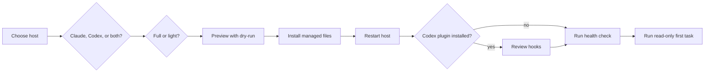

# Installation reference

> **Audience:** new users, administrators, and maintainers
> **Purpose:** document requirements, choices, flags, side effects, ownership, rollback, and uninstall
> **Status:** canonical installer reference

One installer configures Claude Code, Codex, or both. Preview from a checkout when you want to see
every planned action before the installer changes product state.



## Requirements

Install and authenticate at least one supported product first:

- [Claude Code setup](https://docs.anthropic.com/en/docs/claude-code/getting-started)
- [Codex CLI](https://developers.openai.com/codex/cli/)

cc-settings also needs Git and Bun 1.2.21 or newer. The shell and PowerShell bootstraps install Bun
when it is missing. That may create `~/.bun`; cc-settings uninstall does not remove Bun.

The full Claude profile uses `jq` in several skill shell snippets. The installer can use the
available system package manager to install it. That operation may prompt for administrator access,
and uninstall does not remove the system package. Runtime hooks themselves are TypeScript and do
not shell out to `jq`.

Full Codex installation and lifecycle operations that change plugin enrollment require the `codex`
executable. A fresh `--target=codex --light` install does not. The full Codex profile includes the
fixed HTTPS Figma MCP server, which may ask you to authenticate.

MCP means Model Context Protocol, the interface used to connect external tool providers. A
lifecycle hook is a small program that runs around a product event such as a tool call, push, or
session end. A sentinel is the installer-owned version and ownership record used for safe updates
and undo.

## One-line install

**macOS or Linux:**

```bash
bash <(curl -fsSL https://raw.githubusercontent.com/darkroomengineering/cc-settings/main/setup.sh)
```

**Windows PowerShell:**

```powershell
powershell -ExecutionPolicy Bypass -c "irm https://raw.githubusercontent.com/darkroomengineering/cc-settings/main/setup.ps1 | iex"
```

The one-liners run the default `auto` target and cannot forward flags. On macOS and Linux, the
remote bootstrap maintains a durable source checkout at:

```text
${XDG_DATA_HOME:-$HOME/.local/share}/cc-settings/source
```

An existing path is accepted only when it is a real, clean Git checkout with the exact official
HTTPS origin and no commits beyond official `main`. Updates clone official `main` into an isolated
staging directory, prove the existing checkout can fast-forward to that exact commit, then replace
the managed checkout atomically. They do not execute hooks, filters, file monitors, proxies, or
other Git configuration from the existing checkout. The durable checkout makes auto-update and
later maintenance independent of temporary directories.

Clone manually when you want flags or a source checkout that you own:

```bash
git clone https://github.com/darkroomengineering/cc-settings.git
cd cc-settings
bash setup.sh --target=both --dry-run
bash setup.sh --target=both
```

On Windows, use `.\setup.ps1` in place of `bash setup.sh`.

## Select a target

Use `--target=auto|claude|codex|both` with installation and every lifecycle command. Unknown flags
and invalid values fail closed before either product changes.

| Target | Behavior |
|---|---|
| `auto` | Default. Installs both when `codex` is on `PATH`; installs Claude Code only otherwise. |
| `claude` | Manages only `~/.claude` and the cc-settings-owned Claude entries in `~/.claude.json`. |
| `codex` | Manages only `$CODEX_HOME`, or `~/.codex` when `CODEX_HOME` is unset. |
| `both` | Manages Claude Code and Codex in one compensated operation. |

## Full and light profiles

Full is the default. `--light` means the smallest useful native layer for each product, so the two
light profiles are intentionally different.

| Surface | Claude light | Claude full | Codex light | Codex full |
|---|---|---|---|---|
| Shared skills | `share-learning` only | All 38 | None through plugin | All 38 through plugin |
| Instructions | Claude defaults | Darkroom instructions, rules, and profiles | Managed Darkroom `AGENTS.md` block | Same managed block |
| Role agents | None | All Claude roles | None | Native roles except `codex-verifier` |
| Hooks | Statusline only | Full Claude hook set | None through plugin | Compatible plugin hooks |
| MCP servers | None | Context7, TLDR, Figma, Chrome DevTools | None | Fixed HTTPS Figma only |
| Runtime and sentinel | Yes | Yes | Yes | Yes |

Re-run with or without `--light` to switch tiers. The installer removes only entries recorded as
cc-settings-owned.

## Public flags

Run `bash setup.sh --help` or `.\setup.ps1 --help` for the wrapper you use.

| Flag | Effect |
|---|---|
| `--target=auto|claude|codex|both` | Select the product boundary. |
| `--source=<dir>` | Use an explicit cc-settings source checkout. The wrappers normally set this. |
| `--dry-run` | Print the planned operation without changing product state. |
| `--light` | Install or switch to the light profile. Omit for full. |
| `--status` | Report installed versus packaged health for the selected target. |
| `--rollback[=TIMESTAMP]` | Restore the newest eligible backup or the named backup. |
| `--uninstall` | Remove managed state for the selected target and keep backups. |
| `--auto-update=on|off` | Enable or disable the macOS daily update job. |
| `--interactive` | Prompt on supported Claude settings conflicts instead of using non-interactive merge defaults. `CC_INTERACTIVE=1` is equivalent. |
| `--migrate-only` | Run only the Claude settings migration and sentinel path. Codex rejects it; `both` skips Codex. |
| `--help`, `-h` | Show public wrapper usage and every supported flag. |

## Side effects and ownership

The installer owns only the rows marked managed. Paths installed by another product manager remain
outside cc-settings ownership.

| Path or system surface | Action and possible prompt | Ownership | Rollback and uninstall |
|---|---|---|---|
| Claude Code or Codex executable | Required before the selected full install; authentication belongs to that product. | Not owned | Never removed. |
| `${XDG_DATA_HOME:-$HOME/.local/share}/cc-settings/source` | Remote shell install creates or atomically replaces the durable checkout with a fresh, config-isolated copy of official `main`. It refuses a symlink, wrong origin, dirty tree, local commits, or unsafe collision. | Managed remote-install source | Product rollback does not rewind the Git checkout. Uninstall leaves it for maintenance and recovery. |
| A manual cc-settings clone | Read and executed as the source. | User owned | Never removed or changed by uninstall. |
| `~/.bun` | Bootstrap may install Bun when missing. | Not owned | Never removed. |
| System `jq` package | Full Claude install may invoke brew, apt, dnf, yum, pacman, zypper, apk, choco, scoop, winget, or MacPorts. Administrator prompt depends on the manager. | Not owned | Never removed. |
| `~/.claude/CLAUDE.md`, `AGENTS.md`, `settings.json`, `skills/`, `agents/`, `profiles/`, `rules/`, `src/` | Full or light Claude footprint. A first install refuses an unowned same-path collision, including a personal `CLAUDE.md`; preserve or rename it, then migrate its intent into supported user or project scope. | Managed files recorded by hash in the Claude sentinel | Rollback restores the backup snapshot. Uninstall removes owned files only. |
| `~/.claude/src/node_modules` | Installer runs `bun install --production --frozen-lockfile --ignore-scripts` inside the managed runtime. It is a real directory, not a link to the checkout. Legacy owned source links are replaced during update. | Managed runtime dependencies | Regenerated by install; removed by uninstall. The source checkout can disappear without breaking installed scripts. |
| `~/.claude.json` | Full Claude install composes the four managed MCP server entries while preserving unrelated user servers. | Only recognized cc-settings entries | Rollback restores captured state; uninstall removes recognized managed entries. |
| `~/.claude/backups` | Created before destructive Claude changes. | Managed backup store | Rollback reads it. Uninstall leaves backups. |
| `~/Library/LaunchAgents/com.darkroom.cc-settings-autoupdate.plist` and Claude update logs | On macOS, an interactive first install can ask whether to enable a daily 10:00 local update. Explicit `--auto-update` overrides the remembered choice. | Managed scheduler state | Rollback restores the scheduler state captured in that backup. Check or override enrollment afterward. Uninstall and `--auto-update=off` remove the managed job. |
| `$CODEX_HOME/AGENTS.md` or `~/.codex/AGENTS.md` | Writes only the marked Darkroom block and preserves surrounding text. | Managed block | Rollback restores the snapshot; uninstall removes only the block. |
| `$CODEX_HOME/agents/*.toml` and `rules/darkroom.rules` | Full profile writes native roles and command policy. A first install refuses unowned same-name files. | Files listed in the Codex sentinel | Tier switch, rollback, and uninstall remove only recorded files. |
| `$CODEX_HOME/darkroom/source` | Copies an allowlisted runtime package and installs production dependencies. | Managed | Restored or removed with Codex lifecycle operations. |
| `$CODEX_HOME/plugins` enrollment and fixed Figma MCP | Full profile calls the Codex plugin CLI and asks Codex to manage plugin trust. | Managed enrollment, product-owned cache | Rollback restores captured enrollment; uninstall removes cc-settings enrollment. |
| `$CODEX_HOME/backups/cc-settings` | Stores Codex snapshots. | Managed backup store | Rollback reads it. Uninstall leaves backups. |
| `~/.agents/skills` and `$CODEX_HOME/config.toml` (or `~/.codex/config.toml`) | Full Codex install and dry-run read direct child names to warn about legacy entries that duplicate plugin skills. The migration reads Desktop's import-sync setting because enabled sync recreates moved directories. It never edits the Codex config. | Not owned | Run `bun run migrate:codex-skills` to preview. If Desktop import sync is enabled, disable it, restart Codex, and preview again; `--apply` otherwise refuses without moving files or creating a backup. A permitted apply writes a timestamped backup and preserves non-overlaps. |

Reinstalls preserve unrelated Claude permissions, custom hooks, local overrides, and MCP servers.
They preserve unrelated Codex agents, rules, and text outside the marked `AGENTS.md` block.

If Codex reports shortened skill descriptions, follow the
[duplicate legacy skill migration](./codex.md#if-codex-says-skill-descriptions-were-shortened).

## Auto-update

Auto-update is an opt-in macOS scheduler. An interactive first install asks once whether to check
official `main` from isolated staging and rerun setup each day at 10:00 local time. Non-interactive
installs do not create a new decision unless `--auto-update=on|off` is explicit.

The job validates the exact enrolled checkout path and official origin, clones official `main` into
isolated staging, and proves the prior clean checkout is an ancestor. It runs setup from staging and
leaves the enrolled checkout, including ignored files, branches, tags, reflogs, and local Git
configuration, untouched. It never executes mutable Git configuration from the enrolled checkout.
The job records the result in Claude logs. It does not roll back product files after a later setup
failure.

Because auto-update leaves the enrolled checkout untouched, status from that checkout can later say
the packaged source is older than the installed version. Update or replace the checkout before a
manual reinstall. Use `--rollback` when you explicitly intend to downgrade; a normal install refuses
to replace a newer installed version with older packaged source.

Rollback restores the scheduler state saved with the selected backup. If the backup was enrolled,
the job can become enrolled again. Check status and override it when needed:

```bash
bash setup.sh --target=claude --status
bash setup.sh --target=claude --auto-update=off
```

Read the [auto-update threat model](../SECURITY.md#the-auto-update-launchd-job--a-persistence-surface-outside-the-four-layers)
before enabling it on a security-sensitive machine.

## Lifecycle commands

Use the smallest product target that contains the problem:

```bash
bash setup.sh --target=both --dry-run
bash setup.sh --target=both --status
bash setup.sh --target=claude --rollback
bash setup.sh --target=codex --rollback=20260819120000
bash setup.sh --target=both --uninstall
```

Claude and Codex keep separate backup stores. A successful `both` operation gives the paired
backups one shared ID. Bare combined rollback selects the newest common pair and ignores a newer
one-sided backup left by a failed operation. An explicit combined timestamp must identify exactly
one common pair.

Rollback restores files and scheduler or plugin state captured in the backup. Uninstall removes
managed product state and leaves backup stores, Bun, `jq`, the selected products, and manual source
checkouts in place.

## Finish the installation

1. Restart every selected product.
2. In Codex full installs, open `/hooks` and review the plugin hooks.
3. Run product-specific status from the checkout.
4. Claude users can inspect user-scope behavior with
   `bun ~/.claude/src/scripts/whats-on.ts`.
5. Follow [your first session](./first-session.md) and run a read-only exploration task.

See [troubleshooting](./troubleshooting.md) for hook warnings, missing prerequisites, rollback, and
host-specific inspection.
