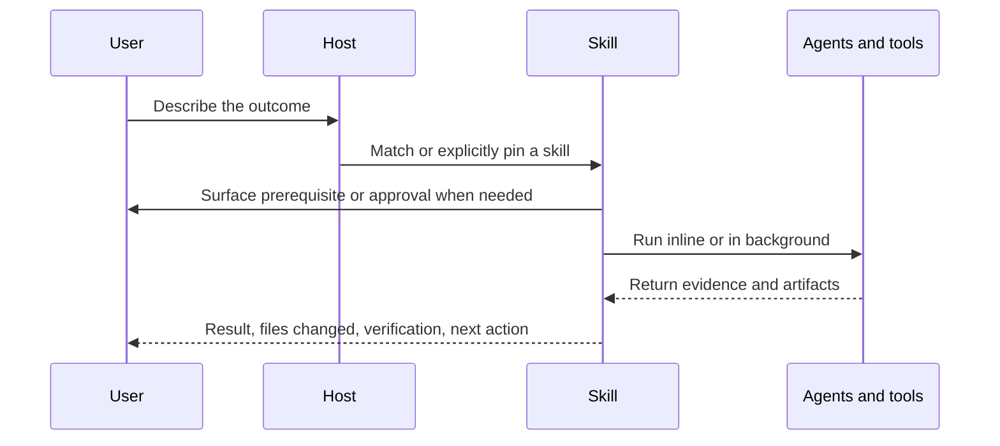

# Skill guide

> **Audience:** anyone using cc-settings in Claude Code or standalone Codex
> **Purpose:** explain the value, effects, approvals, output, run style, prerequisites, and host behavior of every active skill
> **Status:** canonical human skill inventory

You do not need to memorize names. Describe the outcome and let the host match a workflow. Pin a
skill when you need an exact boundary: `/skill-name` in Claude Code and `$skill-name` in standalone
Codex.

The executable procedure remains in each linked `SKILL.md`. This guide explains the human contract.
The canonical active-name registry is `ACTIVE_SKILLS` in
[`src/lib/managed-skills.ts`](../src/lib/managed-skills.ts).

## How selection works

Claude skills marked **background** use a forked context and normally return through a task
notification. You can keep using the main conversation. Codex keeps the same task contract but uses
its native agent and background surfaces. Skills marked **inline** stay in the current conversation.

## What effects and approvals mean

| Effect | Normal behavior |
|---|---|
| Read-only | Inspects state and returns evidence. It must not change repository or external state. |
| Repository write | May edit only the requested repository scope. Reversible in-scope edits normally proceed. |
| Local state write | Writes checkpoints, handoffs, install state, or a session guard outside project code. |
| External write | Changes GitHub, a shared repository, a remote branch, or another visible system. The user must own the decision. |

A skill surfaces missing prerequisites before beginning. It also stops for a material scope change,
an irreversible action, publication, a repository outside the Darkroom organization, or an
unresolved product choice. Ordinary read-only inspection and reversible work inside the request do
not need repeated approval.

## Build and change

| Skill and what to say | Value and output | Effects and approval | Run style and host notes |
|---|---|---|---|
| [`build`](../skills/build/SKILL.md): "build this feature" | Takes a feature through research, plan, implementation, tests, and review. Returns changed files and proof. | Repository write. Stops at the GO/NO-GO gate or a material scope change. | Background. Both hosts; Codex uses native research when Context7 is absent. |
| [`fix`](../skills/fix/SKILL.md): "fix this bug" | Names the cause, reproduces the failure, lands the smallest fix, and verifies it. | Repository write. Bug scope stays narrow; unresolved contract changes stop. | Background. Both hosts with native agents. |
| [`refactor`](../skills/refactor/SKILL.md): "refactor this module" | Restructures code outside the current diff while preserving behavior. Returns tests and review evidence. | Repository write. Broad plans and behavior uncertainty stop before editing. | Background. Both hosts; parallel writers need separate ownership. |
| [`zero-tech-debt`](../skills/zero-tech-debt/SKILL.md): "rewrite this patch as the end state" | Removes compatibility layers, flags, and wrappers that the current patch no longer needs. | Repository write limited to the current diff and its direct callers. | Inline. Both hosts. Use `refactor` for code outside the patch. |
| [`component`](../skills/component/SKILL.md): "create a Button component" | Produces a stack-aware React component in the repository's existing structure. | Repository write. Asks only when the stack or location cannot be inferred safely. | Inline. Both hosts. |
| [`hook`](../skills/hook/SKILL.md): "create useAuth" | Produces a reusable React hook using the project's path and client-boundary conventions. | Repository write. | Inline. Both hosts. |
| [`design-tokens`](../skills/design-tokens/SKILL.md): "create a type scale" or "consolidate tokens" | Generates accessible CSS tokens or reduces an existing token set without visual drift. | Repository write. Visual claims require human or browser validation. | Background. Both hosts. |
| [`dr-init`](../skills/dr-init/SKILL.md): "start a Darkroom project" | Creates a project from the satus or novus starter and explains the chosen stack. | Creates a new directory and downloads a starter. Confirms the starter when unspecified. | Inline. Both hosts; needs network access and Git. |
| [`test`](../skills/test/SKILL.md): "add regression tests" or "TDD this" | Writes and runs tests, or drives a strict red-green-refactor loop. Returns commands and failures. | Repository write when tests are requested; read-only when only running tests. Never weakens an assertion to go green. | Background. Both hosts. |
| [`lighthouse`](../skills/lighthouse/SKILL.md): "improve the Lighthouse scores for this URL" | Measures a page, fixes confirmed problems, and repeats until the stated targets or a blocker. | Repository write plus browser navigation. Never invents scores. | Background. Requires the Lighthouse CLI. Claude also needs Chrome DevTools MCP; Codex needs a configured equivalent or reports unavailable. |
| [`ship`](../skills/ship/SKILL.md): "ship it", "create a PR", or "land this" | Runs the configured proof gates, reviews the diff, performs the requested GitHub operation, watches CI, and reports the final state. | Repository and external write. A failing selected suite stops the pipeline; publication and external-repository policy remain explicit boundaries. | Background. Both hosts need Git and authenticated GitHub access; standalone Codex uses native reviewers. |

## Understand, plan, and decide

| Skill and what to say | Value and output | Effects and approval | Run style and host notes |
|---|---|---|---|
| [`explore`](../skills/explore/SKILL.md): "where does auth happen?" | Maps files, callers, data flow, and architecture with file and line evidence. | Read-only. | Background. Claude uses an Explore agent; Codex uses a read-only native agent or direct inspection. |
| [`tldr`](../skills/tldr/SKILL.md): "who calls this function?" | Returns call graphs, imports, impact, and code-map slices with less context use. | Read-only. | Background. Claude uses TLDR MCP; Codex falls back to `rg` and native navigation. |
| [`plan-feature`](../skills/plan-feature/SKILL.md): "help define this feature" | Interviews for missing decisions, then produces a PRD and dependency-aware execution plan. | Writes a plan artifact only after scope is understood. User owns product decisions. | Background. Both hosts. |
| [`plan-ceo-review`](../skills/plan-ceo-review/SKILL.md): "CEO review this plan" | Challenges whether the plan serves users and the business before implementation begins. | Read-only. The output is a recommendation, not authority to change direction. | Background. Both hosts. |
| [`oracle`](../skills/oracle/SKILL.md): "advise", "what could go wrong?", or "compare these" | Returns engineering advice, a premortem, or a weighted option comparison. | Read-only unless the user separately asks to record a decision. | Background. Both hosts. |
| [`adhd`](../skills/adhd/SKILL.md): "brainstorm beyond the obvious options" | Generates divergent ideas under different constraints, then ranks and deepens the strongest three. | Read-only. Expensive multi-agent ideation is skipped for canonical or closed questions. | Inline coordinator with agent fan-out. Both hosts use native agents. |
| [`strategist`](../skills/strategist/SKILL.md): "help with product positioning" | Connects product direction, market position, and architecture. Returns advice and open decisions. | Read-only and advisory. | Inline. Both hosts. Use `oracle` for a bounded engineering decision. |
| [`context-doc`](../skills/context-doc/SKILL.md): "build our glossary" or "record an ADR" | Aligns domain language through an interview and writes `CONTEXT.md` plus decision records. | Repository write after the user confirms terminology and decisions. | Inline. Both hosts. |

## Review, proof, and diagnosis

| Skill and what to say | Value and output | Effects and approval | Run style and host notes |
|---|---|---|---|
| [`review`](../skills/review/SKILL.md): "review my changes" | Reviews the current diff or inbound PR comments against Darkroom correctness, security, accessibility, and performance rules. | Read-only. Returns findings by severity. | Background. Both hosts. In Claude, distinguish it from the native `/review` alias by asking for the cc-settings local review. |
| [`proof-of-work`](../skills/proof-of-work/SKILL.md): "prove this is review-ready" | Runs the repository's type, test, lint, and relevant visual gates. Returns actual command results. | Read-only apart from tool artifacts. A red gate stays red. | Inline. Both hosts use the installed proof runner. |
| [`verify`](../skills/verify/SKILL.md): "poke holes in this claim" | Uses an issue finder, disprover, and judge to test a specific result adversarially. | Read-only. | Background. Both hosts use separate native agents; standalone Codex never calls the Codex bridge. |
| [`qa`](../skills/qa/SKILL.md): "does this look right?" | Captures the interface and checks layout, contrast, touch targets, accessibility, and design fidelity. | Read-only browser interaction. Reports visual verification unavailable when it cannot capture. | Background. Claude uses Chrome DevTools MCP; Codex needs a configured visual path. |
| [`triage`](../skills/triage/SKILL.md): "first pass on this client repo" | Returns up to 15 ranked, evidence-backed issues and separates safe fixes from client decisions. | Strictly read-only on external repositories. It does not checkout, pull, fetch, commit, push, or open a PR. | Background. Both hosts. Use `audit` for depth. |
| [`audit`](../skills/audit/SKILL.md): "audit the codebase/docs/process/performance/security/motion/SEO" | Sweeps a whole repository with stable finding IDs, concrete scenarios, and disproof. | Reads the repository and writes a report under `docs/audits/`. Optional issue filing is a separate external write decision. | Inline coordinator. Claude performance and dependency modes use configured MCP tools; Codex uses documented fallbacks. |
| [`review-batch`](../skills/review-batch/SKILL.md): "review all pending agent diffs" | Builds re-entry cards and shows the real diffs so several changes can be reviewed in one sitting. | Read-only. | Inline. Both hosts; uses native agent state when available. |

The closest review tools answer different questions:

| Question | Use |
|---|---|
| Did this diff violate a standard or introduce a bug? | `review` |
| Do the real machine gates pass? | `proof-of-work` |
| Can independent agents disprove this claim? | `verify` |
| Does the rendered interface work visually and accessibly? | `qa` |
| What is visibly risky in an unfamiliar repository? | `triage` |
| What is wrong across an entire repository or journey? | `audit` |

## Coordinate and preserve work

| Skill and what to say | Value and output | Effects and approval | Run style and host notes |
|---|---|---|---|
| [`orchestrate`](../skills/orchestrate/SKILL.md): "coordinate this multi-file task" | Builds a dependency graph, assigns bounded workers, tracks progress, integrates, and verifies. | Delegated repository writes follow the underlying task scope. Material plan changes return to the user. | Background coordinator. Host agent mechanics differ; writers always need non-overlapping ownership. |
| [`checkpoint`](../skills/checkpoint/SKILL.md): "save a checkpoint before this migration" | Saves or restores a named mid-task rollback point. | Local state write; restore changes project state and must target an explicit checkpoint. | Background. Product-aware installed runner. |
| [`handoff`](../skills/handoff/SKILL.md): "save this session" or "resume last session" | Saves decisions, files, failures, and next actions for a later session. | Local state write; may update a linked GitHub issue when authorized. | Background. Both products save git-derived state; Claude adds session-ledger behavior. |
| [`freeze`](../skills/freeze/SKILL.md): "only allow edits under src/auth" | Enforces a temporary edit directory in Claude to prevent accidental scope drift. | Writes local guard state, not repository code. | Inline. Claude-only enforcement; unsupported in standalone Codex. |
| [`project`](../skills/project/SKILL.md): "sync this work with the GitHub issue" | Reads the issue as the plan and posts progress so another session can resume. | External read/write. The user owns issue changes and repository access. | Inline. Both hosts need authenticated GitHub access. |
| [`harvest`](../skills/harvest/SKILL.md): "turn this successful workflow into a durable skill" | Measures whether behavior repeats, validates a contract, and promotes only supported evidence. | Repository or team-knowledge write after a PASS verdict and review. | Background. Both hosts; autoresearch follow-up is Claude-only. |
| [`retro`](../skills/retro/SKILL.md): "how was my engineering week?" | Summarizes measured commit and session patterns without inventing savings or velocity. | Reads Git and local metrics, then writes `.context/retros/YYYY-MM-DD.json`. | Background. Both hosts use the installed stats runner. |

## Maintain cc-settings and team knowledge

| Skill and what to say | Value and output | Effects and approval | Run style and host notes |
|---|---|---|---|
| [`cc`](../skills/cc/SKILL.md): "update cc-settings" or "sync Claude upstream" | Refreshes an installed product, or helps maintainers reconcile upstream Claude changes. | Local install or repository write. Update provenance is validated; maintainer sync stops before product decisions. | Inline. Update supports both products; upstream sync is Claude-maintainer work. |
| [`consolidate`](../skills/consolidate/SKILL.md): "clean up redundant rules and skills" | Finds contradictions, duplication, dead instructions, and context bloat, then proposes or performs bounded cleanup. | Read first; repository writes only for confirmed cleanup inside scope. | Background. Both hosts; installed caches are diagnostic, not source. |
| [`autoresearch`](../skills/autoresearch/SKILL.md): "optimize this skill prompt" | Repeats measured prompt mutations and keeps only improvements. | Repeated repository writes to one skill with automatic reverts on worse scores. | Background. Claude-only until Codex has an equivalent controlled evaluation loop. |
| [`share-learning`](../skills/share-learning/SKILL.md): "share this gotcha with the team" | Deduplicates and posts one durable team note with a link. | External write to the team-knowledge repository. Shows the proposed note and confirms before posting. | Inline. Requires `gh`, authentication, and repository access. |
| [`codex`](../skills/codex/SKILL.md): "have Codex review this diff" | Gives a Claude session a second model family for bulk work or independent review. | Read-only for review/ask; repository write for explicitly delegated execution. | Inline. Claude bridge only. Standalone Codex uses native work or a fresh reviewer and never invokes itself recursively. |

## Nearby alternatives

- Use `build` for an end-to-end feature. Use `component` or `hook` for one known UI unit.
- Use `adhd` to generate options. Use `oracle compare` to rank options you already have.
- Use `oracle` for engineering advice. Use `strategist` for product direction. Use
  `plan-ceo-review` to challenge an existing plan before committing to it.
- Use `checkpoint` inside a session. Use `handoff` when another session must continue the work.
- Use `refactor` for behavior-preserving work outside the current diff. Use `zero-tech-debt` to
  simplify the patch currently in front of you.

For the first harmless workflow, follow [your first session](./first-session.md). For missing tools
or unexpected routing, see [troubleshooting](./troubleshooting.md).
