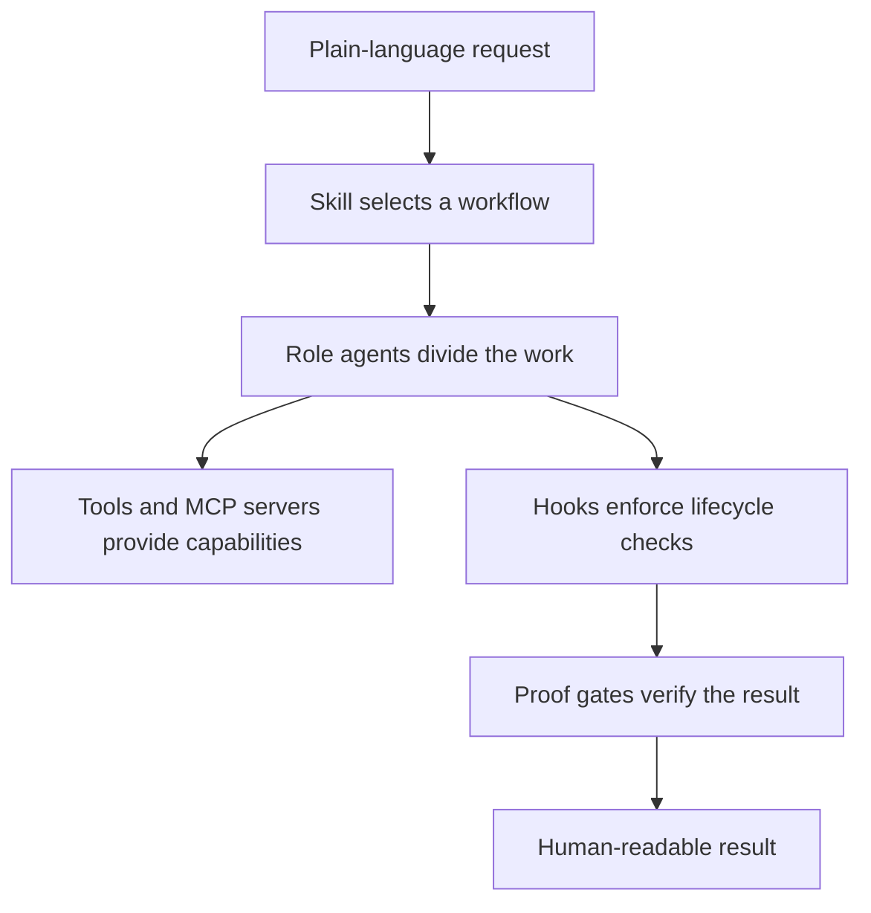

# How cc-settings works

> **Audience:** new users, evaluators, and maintainers
> **Purpose:** explain the product value and the relationship among its runtime parts
> **Status:** canonical concept guide

cc-settings makes an AI coding product behave like a consistent member of the Darkroom engineering
team. One installer supplies shared standards, task workflows, role specialization, safety checks,
and proof gates. The practical value is less machine-to-machine drift: the same request reaches the
same quality and safety expectations on another engineer's laptop.

## The parts in plain language

| Part | What it is | What the user feels |
|---|---|---|
| Standards | Written coding rules and guardrails | The assistant follows the team's defaults without a repeated briefing |
| Skills | Named workflows selected from ordinary language | "Fix this" gets a debugging process; "review this" stays read-only |
| Role agents | Focused workers for planning, exploration, implementation, testing, review, and security | Larger work is divided without making one conversation hold every detail |
| Tools | Filesystem, shell, browser, and product-native capabilities | The workflow can inspect evidence and make authorized changes |
| MCP servers | External tool providers connected through the Model Context Protocol | Claude can fetch current docs, inspect Figma, map code, or drive browser checks |
| Hooks | Small programs that run at lifecycle events | Dangerous commands and missing proof can be stopped before damage or publication |
| Proof gates | Type checks, builds, tests, lint, and visual evidence | "Done" has machine-verifiable receipts |
| Sentinel | Product-specific ownership and version record | Reinstall, rollback, and uninstall can preserve files cc-settings does not own |

A terminal user interface, or TUI, is the interactive Claude Code or Codex screen in a terminal. A
model pool is the set of models available for a main session and delegated work. Neither term is
required to use the product; they only explain the implementation.

## One request from start to finish

1. You describe an outcome in ordinary language.
2. The host matches a skill, or you pin one explicitly.
3. The skill checks prerequisites and surfaces any approval that belongs to you.
4. The host works inline or delegates to focused agents.
5. Tools collect evidence and make changes inside the approved scope.
6. Hooks enforce lifecycle checks around risky operations.
7. Proof gates run the repository's real commands.
8. The result reports the effect, changed files, verification, and unresolved uncertainty.

The workflow may differ between Claude Code and Codex. The outcome contract should not. See
[Claude Code and Codex](./claude-vs-codex.md) for the exact boundary.

## What cc-settings does not replace

cc-settings does not install a Claude Code or Codex subscription for you. It does not grant GitHub,
Figma, browser, or team-repository access. It does not make every shared skill equally capable on
both hosts. It also does not remove human ownership of product direction, irreversible choices,
security decisions, or visual taste.

The installer is ownership-aware rather than machine-owning. It manages declared paths and marked
blocks, preserves unrelated user configuration, and keeps product-specific backups. Review the
[installation side effects](./install.md#side-effects-and-ownership) before the first install.

## Where to go next

- [Your first session](./first-session.md) for a harmless proof that the setup works
- [Skill guide](./skills.md) for value, effects, approvals, and output
- [The flow](./the-flow.md) for the philosophy behind advisory rules and enforced gates
- [Security](../SECURITY.md) for the threat model and recovery path
