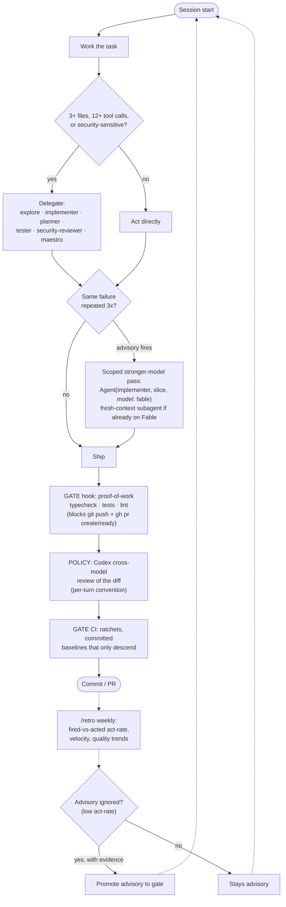

# The Flow — advisories, gates, and the promotion loop

The pieces of cc-settings add up to one loop: **rules start as advisories, work ships through gates, and an advisory is only promoted to a gate when telemetry proves it gets ignored.** The founding observation (from a client project where prose guardrails lost to a 10k-line agent weekend): advisory output is ignorable; a non-zero exit is not.

The three tiers, concretely:

| Tier | Can be ignored? | Examples |
|------|-----------------|----------|
| **Advisory** — injected context | Yes, by design | delegation nudge on broad prompts · quota steering · "escalate to a stronger model" after 3 identical failures |
| **Gate** — non-zero exit | No | permissions deny-list on destructive commands (the safety-net hook is fail-open defense-in-depth on top, see [SECURITY.md](../SECURITY.md)) · `tsc` before commit · proof-of-work before PR · skill-count ratchet (fails in *both* directions, so every movement of the baseline lands in git with a reviewer) |
| **Measurement** — the promotion path | n/a | every escalation advisory logs fired-vs-acted (`bun run escalate:stats`); `/retro` reports the act-rate weekly. An advisory earns gate status with evidence, never by default |

Gates live in the harness today; [farolero](https://github.com/darkroomengineering/farolero) moves the ratchet pattern into client repos as a plain dev-dependency, so it binds agents we don't control — any harness, any model.
